# 逆龄小颜产品需求文档 (PRD) - 页面原型设计版

## 文档信息
- **产品名称**: 逆龄小颜
- **版本**: v2.2（前端Demo开发版）
- **创建日期**: 2024年12月
- **最后更新**: 2025年10月
- **文档状态**: ✅ 完整PRD - 功能设计 + 页面规划 + 前端技术方案
- **设计目标**: 完整的前台+后台页面demo原型（纯前端静态实现）
- **当前进度**: 第一阶段进行中（已完成16页核心原型）

---

## 🎯 快速导航

**想快速了解项目进度？** 👉 [开发进度总览](#-开发进度总览) - 16页已完成，12%整体进度

**想查看已完成的功能？** 👉 [已完成的核心功能](#已完成的核心功能-) - 评估流程、个人中心等

**想了解技术实现？** 👉 [前端技术方案](#6-前端技术方案-) - 路径配置、启动脚本、部署方案

**想查看完整页面规划？** 👉 [页面原型设计规划](#5-页面原型设计规划) - 133页详细清单

---

## 📑 目录

1. [项目概述](#1-项目概述)
   - 1.1 产品定位
   - 1.2 目标用户
   - 1.3 核心价值主张

2. [前台系统功能设计](#2-前台系统功能设计) ⭐
   - 2.1 小程序/H5端功能与页面
   - 2.2 到店咨询大屏端功能与页面
   - 2.3 业务流程图

3. [后台管理系统功能设计](#3-后台管理系统功能设计) ⭐
   - 3.1 用户管理系统
   - 3.2 内容管理系统(CMS)
   - 3.3 数据运营与分析平台
   - 3.4 系统管理与配置
   - 3.5 知识库与内容维护系统

4. [前后台系统对比](#4-前后台系统对比)
   - 4.1 系统定位对比
   - 4.2 功能模块对比
   - 4.3 用户角色与权限
   - 4.4 页面数量预估

5. [页面原型设计规划](#5-页面原型设计规划) 📋
   - 5.1 前台页面清单（含进度状态）
   - 5.2 后台页面清单（含进度状态）
   - 5.3 设计优先级
   - 5.4 里程碑规划
   - **[📊 开发进度总览](#-开发进度总览)** ⭐ 新增

6. [前端技术方案](#6-前端技术方案-) 🔧
   - 6.1 技术栈选型
     - 6.1.4 路径配置方案 ⭐ 新增
     - 6.1.5 启动脚本系统 ⭐ 新增
     - 6.1.7 部署方案 ⭐ 新增
   - 6.2 项目结构
   - 6.3 设计规范
   - 6.4 开发规范

7. [附录](#7-附录)
   - 7.1 竞品分析
   - 7.2 合规要求
   - 7.3 文档版本记录

---

## 1. 项目概述

### 1.1 产品定位
逆龄小颜是一个基于人工智能技术的面部抗衰评估和咨询平台，通过AI专家数字分身为用户提供专业的面部评估、个性化治疗方案推荐和全流程服务体验。

### 1.2 目标用户
- **主要用户**: 25-45岁关注面部抗衰的女性用户
- **高净值用户**: 有一定经济实力，追求专业医美服务的用户
- **潜在用户**: 对医美感兴趣但缺乏专业指导的用户群体

### 1.3 核心价值主张
- 提供专业、客观的面部抗衰评估
- 7x24小时AI专家陪伴服务
- 科学权威的医美知识科普
- 全流程个性化治疗方案

---

## 2. 前台系统功能设计

> **用户角色**: 25-45岁关注面部抗衰的终端用户
>
> **核心目标**: 提供便捷的AI颜值评估、专家咨询、预约服务和个性化内容推荐

### 2.1 小程序/H5端功能与页面

#### 2.1.1 用户注册与登录模块

**页面列表**：
1. **登录页** - 手机号登录/微信一键登录
2. **注册页** - 手机号注册、验证码验证
3. **用户协议页** - 用户协议与隐私政策

**核心功能**：
- 手机号注册/登录
- 微信一键登录
- 用户协议与隐私政策展示
- 实名认证（可选）

---

#### 2.1.2 首页

**页面**: 首页
**核心功能**：
- 产品slogan与品牌展示
- 快速评估入口（CTA按钮）
- AI专家介绍
- 热门服务推荐
- 成功案例轮播
- 科普文章推荐
- 底部导航栏（首页、评估、社区、我的）

---

#### 2.1.3 面部评估模块

**页面列表**：
1. **拍照引导页** - 拍照说明、角度示意
2. **拍照页** - 相机调用、实时预览
3. **照片确认页** - 照片查看、重拍/确认
4. **评估等待页** - 评估进度展示、加载动画
5. **评估报告页** - 完整评估报告展示

**核心功能**：
- 多角度面部照片拍摄引导（正面、侧面、45度角）
- 图片质量检测与优化
- 光线和角度智能提示
- 照片隐私保护机制
- 历史照片管理
- 一键提交评估申请
- 评估进度实时显示
- 评估结果推送通知

---

#### 2.1.4 评估报告模块 ✅ 已实现

**页面列表**：
1. **报告首页** - 评分、总体评价 ✅
2. **多维度改善建议** - 分阶段治疗建议（集成在报告页） ✅
3. **前后对比页** - 预期效果展示（集成在报告页） ✅

**核心功能**：
- ✅ 问题区域智能标注（色斑、皱纹、松弛、毛孔、细纹、暗沉等）
- ✅ 分数评估与同龄对比
- ✅ **多维度改善建议展示** - 包含：
  - 即刻改善方案（1-7天见效）
  - 短期优化方案（1-3个月）
  - 中期提升方案（3-6个月）
  - 长期维护方案（6个月以上）
  - 生活习惯建议
  - 居家护理方案
- ✅ 前后对比效果预览
- ✅ 报告下载打印功能
- 🔄 3D面部模型重建（待实现）
- 🔄 报告分享（待实现）

---

#### 2.1.5 AI专家问答模块

**页面列表**：
1. **对话首页** - 对话历史列表
2. **对话详情页** - 与AI专家聊天界面
3. **报告解读页** - 基于报告的专项解读

**核心功能**：
- 7x24小时在线咨询
- 文字/语音多模态交互
- 报告详细解读
- 抗衰知识科普
- 治疗方案推荐
- 对话历史保存

---

#### 2.1.6 在线预约模块

**页面列表**：
1. **专家列表页** - 可预约专家展示
2. **专家详情页** - 专家介绍、擅长领域
3. **预约日历页** - 可约时间选择
4. **服务项目页** - 服务项目选择
5. **预约确认页** - 订单信息确认
6. **支付页** - 支付方式选择
7. **预约成功页** - 预约信息展示
8. **预约管理页** - 预约记录、改期/取消

**核心功能**：
- 专家时间查询与预约
- 到店服务项目选择
- 预约确认与支付
- 预约提醒（微信通知）
- 预约改期/取消

---

#### 2.1.7 个人中心模块 ✅ 已实现

**页面列表**：
1. **个人中心首页** - 用户信息、功能入口 ✅
2. **个人资料页** - 编辑个人信息 ✅
3. **我的评估报告** - 历史报告列表 ✅
4. **我的预约页** - 预约记录列表 ✅
5. **我的收藏页** - 收藏的文章/案例 ✅
6. **账户设置页** - 隐私设置、通知设置 ✅
7. 🔄 **我的治疗计划** - 治疗进度跟踪（待实现）
8. 🔄 **关于我们页** - 公司介绍、联系方式（待实现）

**核心功能**：
- ✅ 个人资料展示与编辑
- ✅ 我的评估报告列表
- ✅ 我的预约记录管理
- ✅ 我的收藏内容
- ✅ 账户设置（隐私、通知、安全）
- ✅ 底部导航栏（首页、评估、社区、我的）
- 🔄 我的治疗计划（待实现）

---

#### 2.1.8 内容社区模块 ✅ 部分实现

**页面列表**：
1. **社区首页** - 推荐内容Feed流 ✅
2. 🔄 **文章详情页** - 科普文章阅读（待实现）
3. 🔄 **案例详情页** - 真实案例查看（待实现）
4. 🔄 **视频播放页** - 专家视频内容（待实现）
5. 🔄 **评论页** - 用户评论与互动（待实现）
6. 🔄 **搜索页** - 内容搜索（待实现）

**核心功能**：
- ✅ 社区首页Feed流展示
- ✅ 内容分类（文章、案例、视频）
- ✅ 内容预览卡片
- 🔄 个性化内容推荐（待实现）
- 🔄 科学抗衰科普文章详情（待实现）
- 🔄 真实案例分享（待实现）
- 🔄 专家视频内容（待实现）
- 🔄 用户评价与互动（待实现）

---

#### 2.1.9 营销活动模块

**页面列表**：
1. **活动列表页** - 进行中的活动
2. **活动详情页** - 活动规则说明
3. **优惠券页** - 可用/已用优惠券
4. **积分商城页** - 积分兑换
5. **邀请好友页** - 邀请海报、奖励规则

**核心功能**：
- 新人优惠活动
- 限时优惠推送
- 好友邀请奖励
- 积分兑换体系

---

#### 2.1.10 社交分享模块

**核心功能**：
- 评估结果分享（脱敏）
- 治疗历程记录分享
- 邀请好友体验
- 内容转发到社交平台

---

### 2.2 到店咨询大屏端功能与页面

> **使用场景**: 用户到店后，在咨询室通过大屏进行AI专家咨询
> 
> **特点**: 大屏展示、视觉震撼、全息投影、触控交互

#### 2.2.1 大屏端页面列表

1. **欢迎页** - 用户到店识别、欢迎语
2. **用户信息页** - 用户基本信息调取
3. **报告展示页** - 3D面部模型大屏展示
4. **AI解读页** - AI专家全息投影讲解
5. **互动问答页** - 触控/语音交互
6. **方案推荐页** - 治疗方案展示
7. **人工接入页** - 真人专家接入界面
8. **满意度评价页** - 服务评价

#### 2.2.2 核心功能

1. **欢迎与身份识别**
   - 用户到店自动识别
   - 预约信息调取
   - 个性化欢迎语

2. **AI分身主导报告解读**
   - 全息投影显示AI专家形象
   - 3D面部模型大屏展示
   - AI专家语音讲解报告
   - 实时互动问答
   - 治疗方案推荐

3. **人机协同服务流程**
   - 复杂问题自动转接真人专家
   - 专家与AI协同服务
   - 方案讨论与确认
   - 个性化定制服务
   - 价格方案展示

4. **服务记录**
   - 咨询内容自动记录
   - 服务满意度评价
   - 后续跟进提醒

---

### 2.3 业务流程图

#### 2.3.1 用户使用完整流程

```mermaid
flowchart TD
    Start([用户访问小程序]) --> A[首页浏览]
    A --> B[拍照上传]
    B --> C[AI面部评估]
    C --> D[查看评估报告]
    D --> E{是否需要进一步咨询}
    E -->|是| F[AI专家在线问答]
    E -->|否| G[浏览治疗建议]
    F --> H{是否需要预约}
    H -->|是| I[在线预约专家]
    H -->|否| G
    I --> J[到店咨询]
    J --> K[大屏AI分身服务]
    K --> L[真人专家协同]
    L --> M[制定治疗方案]
    M --> N[开始治疗]
    N --> O[治疗进度跟踪]
    O --> P[效果评估]
    P --> Q{是否需要复诊}
    Q -->|是| I
    Q -->|否| End([服务完成])
    G --> End
```



#### 2.3.2 小程序使用流程

```
用户打开小程序
    ↓
首页浏览（了解产品）
    ↓
点击"立即评估"
    ↓
拍摄面部照片（引导）
    ↓
上传照片
    ↓
等待AI评估（30秒-1分钟）
    ↓
查看评估报告
    ↓
【分支1】AI专家在线咨询
【分支2】浏览科普内容
【分支3】在线预约专家
    ↓
形成转化或留存
```

---

## 3. 后台管理系统功能设计

> **用户角色**: 平台运营人员、数据分析师、医疗专家、客服主管、知识管理员、系统管理员
> 
> **核心目标**: 实现数据驱动的智能运营、用户管理、内容管理和业务分析

### 3.1 用户管理系统

#### 3.1.1 页面列表

1. **用户列表页** - 所有用户展示、筛选、搜索
2. **用户详情页** - 用户完整信息展示
3. **用户编辑页** - 编辑用户信息
4. **用户标签管理页** - 标签分类、新建标签
5. **黑名单管理页** - 黑名单用户列表
6. **用户行为分析页** - 单个用户行为轨迹
7. **用户分群页** - 用户分群创建与管理
8. **CRM客户管理页** - 客户跟进记录
9. **工单管理页** - 客服工单列表与详情

#### 3.1.2 核心功能

1. **用户信息管理**
   - 用户基本资料查看/编辑
   - 用户认证状态管理
   - 用户标签管理
   - 用户黑名单管理

2. **用户行为分析**
   - 用户访问轨迹查看
   - 评估记录查询
   - 咨询记录查询
   - 预约历史查询

3. **用户分层运营**
   - 用户画像标签化
   - 用户分群管理
   - 高价值用户识别
   - 流失用户预警

4. **客户关系管理（CRM）**
   - 客户跟进记录
   - 销售漏斗管理
   - 转化率统计
   - 客服工单管理

---

### 3.2 内容管理系统（CMS）

#### 3.2.1 页面列表

1. **内容列表页** - 所有内容展示（文章/案例/视频）
2. **文章编辑器页** - 富文本编辑器
3. **案例编辑页** - 案例内容编辑
4. **素材库页** - 图片/视频素材管理
5. **分类管理页** - 内容分类与标签
6. **审核列表页** - 待审核内容
7. **发布管理页** - 已发布内容管理
8. **营销活动配置页** - 活动创建与配置
9. **优惠券管理页** - 优惠券发放与管理
10. **推送消息页** - 消息推送配置
11. **Banner管理页** - 首页Banner配置

#### 3.2.2 核心功能

1. **文章内容管理**
   - 科普文章发布/编辑
   - 案例内容管理
   - 专家内容审核
   - 内容分类与标签

2. **多媒体管理**
   - 图片素材库
   - 视频内容管理
   - 3D模型资源管理

3. **营销活动管理**
   - 活动创建与配置
   - 优惠券管理
   - 推送消息管理
   - Banner广告位管理

4. **内容推荐配置**
   - 推荐算法参数调整
   - 个性化内容策略
   - A/B测试管理

---

### 3.3 数据运营与分析平台

#### 3.3.1 页面列表

1. **数据看板页** - 核心数据总览
2. **用户分析页** - 用户数据详细分析
3. **业务分析页** - 业务数据分析
4. **转化漏斗页** - 转化路径可视化
5. **案例归档页** - 案例库管理
6. **效果对比页** - 治疗前后效果
7. **AI效果监控页** - AI模型效果统计
8. **高意向客户页** - 高意向客户列表
9. **报表中心页** - 各类报表下载
10. **自定义报表页** - 自定义报表配置

#### 3.3.2 核心功能

1. **业务数据看板**
   - 实时用户数据（注册、活跃、留存）
   - 业务数据监控（评估量、咨询量、预约量）
   - 收入数据统计
   - 关键指标趋势图

2. **转化漏斗分析**
   - 用户转化路径可视化
   - 各环节转化率分析
   - 关键节点优化建议
   - 流失原因分析

3. **案例归档管理**
   - 用户案例存储与检索
   - 治疗前后对比记录
   - 治疗效果评估
   - 专家评价系统
   - 案例脱敏处理

4. **AI模型效果监控**
   - 评估准确率统计
   - AI响应时间监控
   - 用户满意度追踪
   - 模型迭代效果对比

5. **高意向客户识别**
   - 客户意向度评分模型
   - 高意向客户列表
   - 自动提醒跟进
   - 转化成功率统计

6. **运营报表生成**
   - 日报/周报/月报自动生成
   - 自定义报表配置
   - 数据导出功能
   - ROI分析报告

---

### 3.4 系统管理与配置

#### 3.4.1 页面列表

1. **角色管理页** - 角色列表与权限配置
2. **账号管理页** - 管理员账号管理
3. **权限配置页** - 菜单权限配置
4. **操作日志页** - 系统操作记录
5. **系统参数页** - 基础参数设置
6. **第三方配置页** - 三方服务配置
7. **API管理页** - API接口管理
8. **监控告警页** - 系统监控与告警
9. **专家管理页** - 专家信息维护
10. **排班管理页** - 专家排班设置

#### 3.4.2 核心功能

1. **权限管理**
   - 角色权限配置（运营、客服、管理员、数据分析师等）
   - 用户账号管理
   - 操作日志记录
   - 敏感操作审计

2. **系统配置**
   - 基础参数设置
   - 第三方服务配置（支付、短信、云存储等）
   - API接口管理
   - 系统监控告警

3. **专家管理**
   - 专家信息维护
   - 专家排班管理
   - 专家评价管理
   - 服务配置

---

### 3.5 知识库与内容维护系统 ⭐

> **重要性**: 知识库是AI系统的"大脑"，直接影响AI回答质量

#### 3.5.1 页面列表

1. **知识库首页** - 知识概览与统计
2. **知识列表页** - 所有知识条目
3. **知识编辑器页** - 知识条目编辑
4. **知识分类页** - 分类与标签管理
5. **SOP管理页** - 诊疗SOP文档
6. **FAQ管理页** - 常见问题库
7. **医美词典页** - 专业术语管理
8. **案例知识库页** - 典型案例管理
9. **知识审核页** - 审核工作流
10. **版本管理页** - 知识版本控制
11. **效果评估页** - 知识引用统计
12. **缺口分析页** - 知识缺口识别
13. **导入导出页** - 批量导入导出

#### 3.5.2 核心功能

1. **专家知识库管理**
   - 专家知识条目录入/编辑
   - 知识分类与标签体系
   - 知识关联关系管理
   - 多维度知识检索
   - 知识质量评分
   - 知识引用统计

2. **诊疗SOP维护**
   - 诊疗流程标准化管理
   - 各项目SOP文档编辑
   - SOP版本管理与对比
   - SOP执行效果追踪
   - SOP优化建议收集

3. **FAQ知识库管理**
   - 常见问题库维护
   - 问题分类与标签
   - 标准答案编辑
   - 相似问题关联
   - 问题命中率统计
   - 未知问题收集与整理

4. **医美知识内容库**
   - 专业术语词典管理
   - 抗衰知识条目管理
   - 治疗方法知识库
   - 产品成分知识库
   - 医学文献资料库
   - 行业标准与规范

5. **案例知识库**
   - 典型案例归档
   - 案例标签与分类
   - 案例知识提取
   - 成功经验沉淀
   - 失败案例警示

6. **知识审核流程**
   - 知识提交审核机制
   - 多级审核流程配置
   - 专家审核意见记录
   - 审核通过/驳回管理
   - 审核历史追溯

7. **知识版本控制**
   - 知识变更历史记录
   - 版本对比与回滚
   - 变更原因说明
   - 版本发布管理
   - 灰度发布控制

8. **知识效果评估**
   - AI引用知识统计
   - 知识有效性评估
   - 用户满意度关联
   - 无效知识识别
   - 知识缺口分析
   - 优化建议生成

9. **知识导入导出**
   - 批量知识导入（Excel/CSV）
   - 知识模板下载
   - 知识数据导出
   - 第三方知识库对接

10. **知识协同编辑**
    - 多人协同编辑
    - 编辑权限控制
    - 编辑冲突处理
    - 评论与讨论功能
    - @专家协作

---

## 4. 前后台系统对比

### 4.1 系统定位对比

| 对比维度 | 前台系统（C端） | 后台管理系统（B端） |
|---------|---------------|-------------------|
| **目标用户** | 终端消费者（25-45岁女性用户） | 管理人员、运营人员、数据分析师 |
| **核心诉求** | 获取服务、便捷体验、专业咨询 | 数据分析、运营管理、效率提升 |
| **访问方式** | 小程序/H5/移动App | Web后台（PC端为主） |
| **使用频率** | 碎片化、高频（每天多次） | 持续工作、中频（工作时段） |
| **界面风格** | 简洁美观、易用性强、视觉吸引 | 功能丰富、信息密度高、专业严谨 |
| **主要操作** | 浏览、咨询、预约、分享 | 查询、分析、配置、管理、审核 |
| **数据权限** | 只能查看自己的数据 | 可查看所有用户数据（按权限） |
| **核心指标** | 用户体验、转化率、留存率 | 运营效率、数据准确性、决策支持 |

### 4.2 功能模块对比

| 前台系统核心功能 | 后台管理系统核心功能 |
|----------------|-------------------|
| ✅ 用户注册登录 | ✅ 用户信息管理 |
| ✅ 面部拍照上传 | ✅ 用户行为分析 |
| ✅ AI颜值评估 | ✅ 用户分层运营 |
| ✅ 评估报告展示 | ✅ 客户关系管理(CRM) |
| ✅ AI专家问答 | ✅ 文章内容管理 |
| ✅ 在线预约服务 | ✅ 多媒体资源管理 |
| ✅ 个人中心 | ✅ 营销活动管理 |
| ✅ 内容社区 | ✅ 业务数据看板 |
| ✅ 营销活动参与 | ✅ 转化漏斗分析 |
| ✅ 社交分享 | ✅ 案例归档管理 |
| - | ✅ AI模型效果监控 |
| - | ✅ 高意向客户识别 |
| - | ✅ 运营报表生成 |
| - | ✅ **知识库维护系统** ⭐ |
| - | ✅ 权限管理 |
| - | ✅ 系统配置 |

### 4.3 用户角色与权限

#### 4.3.1 前台系统用户角色

| 角色 | 权限范围 | 主要功能 |
|-----|---------|---------|
| 普通用户 | 查看自己的数据 | 评估、咨询、预约、查看报告 |
| VIP会员 | 查看自己的数据 + 高级功能 | 优先预约、专属客服、会员内容 |

#### 4.3.2 后台系统用户角色

| 角色 | 权限范围 | 主要功能 | 可访问模块 |
|-----|---------|---------|-----------|
| 系统管理员 | 全部权限 | 系统配置、权限管理、所有功能 | 所有模块 |
| 运营人员 | 内容、营销、用户管理 | 内容发布、活动配置、用户运营 | CMS、营销、部分用户管理 |
| 数据分析师 | 数据查询、报表导出 | 数据分析、报表生成、转化分析 | 数据分析平台 |
| 客服主管 | 用户管理、CRM | 客户跟进、工单管理、沟通记录 | 用户管理、CRM |
| 知识管理员 | 知识库维护 | 知识编辑、审核、版本控制 ⭐ | 知识库系统 |
| 医疗专家 | 知识审核、案例管理 | 知识审核、专业意见、案例评估 | 知识库审核、案例管理 |

### 4.4 页面数量预估

| 系统 | 页面数量 | 说明 |
|-----|---------|------|
| **前台 - 小程序/H5** | **40-50个页面** | 包含所有功能模块的页面 |
| **前台 - 到店大屏** | **8-10个页面** | 专注于到店咨询场景 |
| **后台管理系统** | **60-80个页面** | 包含5大子系统的所有页面 |
| **合计** | **约110-140个页面** | 完整的页面demo原型 |

---

## 5. 页面原型设计规划

### 5.1 前台页面清单

#### 5.1.1 小程序/H5端（40-50页）

**基础模块（8页）** - 进度: 2/8 ✅
1. 🔄 启动页/闪屏页
2. ✅ 登录页 (web/pages-chat/auth/login.html)
3. 🔄 注册页
4. 🔄 用户协议页
5. 🔄 隐私政策页
6. ✅ 首页 (web/index.html)
7. 🔄 搜索页
8. 🔄 通知中心页

**评估模块（10页）** - 进度: 5/10 ✅
9. ✅ 拍照引导页 (web/pages-chat/assessment/guide.html)
10. ✅ 拍照页 (web/pages-chat/assessment/camera.html)
11. ✅ 照片确认页 (web/pages-chat/assessment/confirm.html)
12. 🔄 历史照片管理页
13. ✅ 评估等待页 (web/pages-chat/assessment/waiting.html)
14. ✅ 评估报告首页 (web/pages-chat/assessment/report.html)
    - 包含多维度改善建议
    - 包含前后对比效果
15. 🔄 问题详情页（色斑）
16. 🔄 问题详情页（皱纹）
17. 🔄 问题详情页（松弛）
18. 🔄 改善建议页（已集成到报告页）
19. 🔄 前后对比页（已集成到报告页）
20. 🔄 报告分享页

**AI问答模块（3页）** - 进度: 0/3 🔄
21. 🔄 对话列表页 (web/pages-chat/chat/index.html)
22. 🔄 对话详情页 (web/pages-chat/chat/detail.html)
23. 🔄 报告解读页 (web/pages-chat/chat/report.html)

**预约模块（8页）** - 进度: 0/8 🔄
24. 🔄 专家列表页 (web/pages-chat/booking/experts.html)
25. 🔄 专家详情页
26. 🔄 预约日历页
27. 🔄 服务项目页
28. 🔄 预约确认页 (web/pages-chat/booking/confirm.html)
29. 🔄 支付页
30. 🔄 支付成功页
31. 🔄 预约管理页（已集成到个人中心）

**个人中心（8页）** - 进度: 6/8 ✅
32. ✅ 个人中心首页 (web/pages-chat/profile/index.html)
33. ✅ 个人资料页 (web/pages-chat/profile/edit.html)
34. ✅ 我的评估报告列表 (web/pages-chat/profile/reports.html)
35. ✅ 我的预约页 (web/pages-chat/profile/appointments.html)
36. 🔄 我的治疗计划页
37. ✅ 我的收藏页 (web/pages-chat/profile/favorites.html)
38. ✅ 账户设置页 (web/pages-chat/profile/settings.html)
39. 🔄 关于我们页

**内容社区（5页）** - 进度: 1/5 ✅
40. ✅ 社区首页 (web/pages-chat/community/index.html)
41. 🔄 文章详情页
42. 🔄 案例详情页
43. 🔄 视频播放页
44. 🔄 评论页

**营销活动（5页）** - 进度: 0/5 🔄
45. 🔄 活动列表页 (web/pages-chat/activity/)
46. 🔄 活动详情页
47. 🔄 优惠券页
48. 🔄 积分商城页
49. 🔄 邀请好友页

**前台小程序/H5端合计**: 49页
**已完成**: 14页 (29%)
**进行中**: 35页 (71%)

#### 5.1.2 到店大屏端（8-10页）- 进度: 0/10 🔄

1. 🔄 待机屏保页 (store/)
2. 🔄 欢迎页 (store/index.html)
3. 🔄 用户信息页
4. 🔄 报告展示页 (store/pages/report.html)
5. 🔄 AI解读页 (store/pages/ai-chat.html)
6. 🔄 互动问答页
7. 🔄 方案推荐页
8. 🔄 人工接入页
9. 🔄 满意度评价页 (store/pages/feedback.html)
10. 🔄 结束页

**到店大屏端合计**: 10页
**已完成**: 0页 (0%)
**待开发**: 10页 (100%)

---

### 5.2 后台页面清单

#### 5.2.1 基础模块 - 进度: 2/2 ✅

1. ✅ 登录页 (admin/login.html)
2. ✅ 数据看板首页 (admin/index.html)

#### 5.2.2 用户管理系统（12页）- 进度: 0/12 📋

1. 📋 用户列表页 (admin/pages/users/list.html)
2. 📋 用户详情页 (admin/pages/users/detail.html)
3. 📋 用户编辑页
4. 📋 用户标签管理页
5. 📋 黑名单管理页
6. 📋 用户行为分析页
7. 📋 用户分群页
8. 📋 分群创建页
9. 📋 CRM客户管理页
10. 📋 客户跟进详情页
11. 📋 工单管理页

#### 5.2.3 内容管理系统（15页）- 进度: 0/15 📋

12. 📋 内容列表页（文章） (admin/pages/content/)
13. 📋 内容列表页（案例）
14. 📋 内容列表页（视频）
15. 📋 文章编辑器页
16. 📋 案例编辑页
17. 📋 视频上传页
18. 📋 素材库页
19. 📋 分类管理页
20. 📋 审核列表页
21. 📋 审核详情页
22. 📋 营销活动列表页
23. 📋 活动配置页
24. 📋 优惠券管理页
25. 📋 推送消息页
26. 📋 Banner管理页

#### 5.2.4 数据运营与分析平台（15页）- 进度: 0/15 📋

27. 📋 数据看板页（总览） (admin/pages/analytics/)
28. 📋 用户数据分析页
29. 📋 业务数据分析页
30. 📋 转化漏斗页
31. 📋 漏斗详细分析页
32. 📋 案例归档列表页
33. 📋 案例详情页
34. 📋 效果对比页
35. 📋 AI效果监控页
36. 📋 模型准确率页
37. 📋 高意向客户列表页
38. 📋 客户详情页
39. 📋 报表中心页
40. 📋 自定义报表配置页
41. 📋 报表详情页

#### 5.2.5 系统管理与配置（12页）- 进度: 0/12 📋

42. 📋 角色管理页 (admin/pages/system/)
43. 📋 角色权限配置页
44. 📋 账号管理页
45. 📋 账号创建/编辑页
46. 📋 操作日志页
47. 📋 系统参数页
48. 📋 第三方配置页
49. 📋 API管理页
50. 📋 监控告警页
51. 📋 专家管理页
52. 📋 专家详情/编辑页
53. 📋 排班管理页

#### 5.2.6 知识库维护系统（18页）- 进度: 0/18 📋

54. 📋 知识库首页（Dashboard） (admin/pages/knowledge/)
55. 📋 知识列表页
56. 📋 知识编辑器页
57. 📋 知识详情页
58. 📋 知识分类页
59. 📋 标签管理页
60. 📋 SOP管理页
61. 📋 SOP编辑页
62. 📋 FAQ管理页
63. 📋 FAQ编辑页
64. 📋 医美词典页
65. 📋 词条编辑页
66. 📋 案例知识库页
67. 📋 知识审核列表页
68. 📋 审核详情页
69. 📋 版本管理页
70. 📋 版本对比页
71. 📋 效果评估页
72. 📋 知识引用统计页
73. 📋 缺口分析页
74. 📋 导入导出页

**后台合计**: 74页
**已完成**: 2页（登录页+数据看板，仅为基础框架）
**待开发**: 72页 (97%)
**注意**: admin/pages/ 目录下所有子目录均为空，实际仅完成2个基础页面

---

---

## 📊 开发进度总览

### 整体进度

| 系统 | 计划页数 | 已完成 | 进度 | 状态 |
|-----|---------|--------|------|------|
| **前台 - 小程序/H5** | 49页 | 14页 | 29% | 🔄 进行中 |
| **前台 - 到店大屏** | 10页 | 0页 | 0% | 📋 待开始 |
| **后台管理系统** | 74页 | 2页 | 3% | 🔄 进行中 |
| **合计** | **133页** | **16页** | **12%** | 🚀 **第一阶段** |

### 前台详细进度

| 模块 | 计划页数 | 已完成 | 进度 |
|-----|---------|--------|------|
| 基础模块 | 8页 | 2页 | 25% ✅ |
| 评估模块 | 10页 | 5页 | 50% ✅ |
| AI问答模块 | 3页 | 0页 | 0% 🔄 |
| 预约模块 | 8页 | 0页 | 0% 🔄 |
| 个人中心 | 8页 | 6页 | 75% ✅ |
| 内容社区 | 5页 | 1页 | 20% ✅ |
| 营销活动 | 5页 | 0页 | 0% 🔄 |
| 到店大屏 | 10页 | 0页 | 0% 📋 |

### 后台详细进度

| 模块 | 计划页数 | 已完成 | 进度 |
|-----|---------|--------|------|
| 基础模块 | 2页 | 2页 | 100% ✅ |
| 用户管理 | 12页 | 0页 | 0% 🔄 |
| 内容管理 | 15页 | 0页 | 0% 🔄 |
| 数据分析 | 15页 | 0页 | 0% 🔄 |
| 系统管理 | 12页 | 0页 | 0% 🔄 |
| 知识库 ⭐ | 18页 | 0页 | 0% 🔄 |

### 已完成的核心功能 ✅

**前台（14页）**：
1. ✅ 首页 - 炫彩渐变Hero区、服务展示、案例轮播
2. ✅ 登录页 - 手机号登录、微信登录
3. ✅ 评估流程（5页完整闭环）
   - 拍照引导页
   - 拍照页（相机调用）
   - 照片确认页
   - 评估等待页（动画效果）
   - **评估报告页**（含多维度改善建议、前后对比）
4. ✅ 个人中心（6页）
   - 个人中心首页
   - 个人资料编辑
   - 我的报告列表
   - 我的预约
   - 我的收藏
   - 账户设置
5. ✅ 社区首页 - Feed流展示

**后台（2页）**：
1. ✅ 登录页
2. ✅ 数据看板首页

### 下一步开发计划 🎯

**优先级P0（第一阶段剩余）**：
1. AI问答模块（3页）
2. 预约模块核心流程（2-3页）
3. 后台用户管理核心（3-5页）
4. 后台知识库核心（4-5页）

---

### 5.3 设计优先级

#### P0 - 核心功能（第一阶段）✅ 进行中

**前台（15页）** - 已完成 14/15：
- ✅ 基础模块：登录、首页（2页）
- ✅ 评估核心：拍照引导、拍照、确认、等待、报告（5页）
- ✅ 个人中心：首页、资料、报告、预约、收藏、设置（6页）
- ✅ 社区核心：社区首页（1页）
- 🔄 AI问答：对话详情（1页）

**后台（20页）** - 已完成 2/20：
- ✅ 登录、数据看板（2页）
- 🔄 用户管理：用户列表、用户详情（2页）
- 🔄 内容管理：内容列表、文章编辑、审核列表（3页）
- 🔄 数据分析：业务分析、转化漏斗、高意向客户（3页）
- 🔄 知识库：知识列表、知识编辑、FAQ管理、审核列表（4页）⭐
- 🔄 系统管理：角色管理、权限配置（2页）

#### P1 - 重要功能（建议设计）

**前台（15页）**：
- 完整评估流程的其他页面
- 预约的其他流程页面
- 个人中心的其他页面
- 营销活动页面

**后台（25页）**：
- 用户管理的其他功能
- 内容管理的其他功能
- 数据分析的详细页面
- 知识库的辅助功能

#### P2 - 次要功能（可选设计）

**前台（10页）**：
- 优化和辅助页面
- 营销活动详细页面

**后台（15页）**：
- 高级配置页面
- 详细统计页面

---

### 5.4 里程碑规划

#### 第一阶段：核心功能原型设计（2周）

**前台（15页）**：
- Week 1: 登录注册、首页、拍照评估流程（8页）
- Week 2: AI问答、预约核心、个人中心核心（7页）

**后台（20页）**：
- Week 1: 用户管理、内容管理核心（10页）
- Week 2: 数据看板、知识库核心（10页）

**交付物**：
- 35页核心原型
- 主要业务流程可演示

---

#### 第二阶段：重要功能完善（2周）

**前台（20页）**：
- Week 3: 完整评估流程、完整预约流程（10页）
- Week 4: 社区功能、到店大屏（10页）

**后台（30页）**：
- Week 3: 用户管理完善、内容管理完善（15页）
- Week 4: 数据分析完善、知识库完善（15页）

**交付物**：
- 85页完整原型
- 所有核心业务流程完整

---

#### 第三阶段：细节优化与补充（1周）

**前台（10-15页）**：
- Week 5: 营销活动、辅助页面、优化细节

**后台（20-25页）**：
- Week 5: 系统管理、高级配置、报表详情

**交付物**：
- 110-125页完整原型
- 交互细节完善
- 准备开发交接

---

#### 时间线总结

| 阶段 | 周期 | 前台页面 | 后台页面 | 累计页面 |
|-----|------|---------|---------|---------|
| 第一阶段 | 2周 | 15页 | 20页 | 35页 |
| 第二阶段 | 2周 | +20页 | +30页 | 85页 |
| 第三阶段 | 1周 | +10-15页 | +20-25页 | 115-135页 |
| **总计** | **5周** | **45-50页** | **70-75页** | **115-135页** |

---

## 6. 前端技术方案 🔧

> **说明**: 本项目采用纯前端静态技术栈，无需后端服务器，使用浏览器本地存储模拟数据持久化

### 6.1 技术栈选型

#### 6.1.1 核心技术
- **客户端**：
  - `HTML5/CSS3/JavaScript(ES6+)` - 标准Web技术
  - `Tailwind CSS`（CDN）- 响应式UI框架，快速构建界面
  - `Font Awesome`（CDN）- 图标库
  - `Chart.js`（CDN）- 数据可视化（后台数据看板使用）
  - `Marked.js`（CDN）- Markdown渲染（知识库内容展示）
  - **移动端优先布局**（Mobile First）

- **样式方案**：
  - 在页面内通过 `<script>` 配置 `tailwind.config`
  - 扩展 Design Tokens（品牌色、主题色）
  - 使用Tailwind的响应式类名（sm:、md:、lg:）

#### 6.1.2 数据存储
- **浏览器 localStorage**：
  - 键名前缀：`aibeauty`
  - 数据集合示例：
    ```javascript
    // 前台数据
    aibeauty_users         // 用户数据
    aibeauty_assessments   // 评估记录
    aibeauty_reports       // 评估报告
    aibeauty_appointments  // 预约记录
    aibeauty_chats         // AI对话历史
    aibeauty_articles      // 文章内容
    aibeauty_cases         // 案例数据
    
    // 后台数据
    aibeauty_admin_users   // 管理员账号
    aibeauty_knowledge     // 知识库数据
    aibeauty_analytics     // 统计数据
    aibeauty_settings      // 系统配置
    ```

#### 6.1.3 数据通信
- **无网络依赖**：纯本地运行，所有数据存储在浏览器
- **模拟异步**：使用 `setTimeout` 模拟API调用延迟
- **页面间通信**：
  - URL参数传递（如：`?id=123`）
  - localStorage 共享数据
  - sessionStorage 临时数据

- **占位功能**：
  - 打印功能 → `window.print()`
  - 分享功能 → 弹窗提示或复制链接
  - 导出功能 → 下载 JSON/CSV 文件
  - 上传图片 → 转base64存储在localStorage

#### 6.1.4 路径配置方案 ⭐

**多环境部署支持**：
为了支持本地开发、GitHub Pages、Gitee Pages等多种部署环境，项目实现了智能路径配置系统。

**路径配置工具**（`shared/path-config.js`）：
```javascript
// 自动检测部署环境
function detectEnvironment() {
  const hostname = window.location.hostname;
  const pathname = window.location.pathname;
  
  // GitHub Pages / Gitee Pages
  if (hostname.includes('github.io') || hostname.includes('gitee.io')) {
    const pathParts = pathname.split('/').filter(p => p);
    return {
      type: 'pages',
      basePath: '/' + pathParts[0]  // 例如: /AI_YanLab
    };
  }
  
  // 本地开发环境
  return { type: 'local', basePath: '' };
}

// 获取资源路径
PathConfig.getAssetPath('/shared/utils.js')
// 本地: /shared/utils.js
// Pages: /AI_YanLab/shared/utils.js
```

**使用方式**：
```html
<!-- 在HTML中引入路径配置 -->
<script src="../shared/path-config.js"></script>
<script>
  // 动态加载共享脚本
  PathConfig.loadSharedScripts().then(() => {
    console.log('脚本加载完成');
  });
</script>
```

**支持的部署环境**：
- ✅ 本地开发（localhost）
- ✅ GitHub Pages（username.github.io/repo）
- ✅ Gitee Pages（username.gitee.io/repo）
- ✅ 自定义域名
- ✅ 局域网访问（192.168.x.x）

#### 6.1.5 启动脚本系统 ⭐

**一键启动**：
项目提供了跨平台的启动脚本，支持双击启动，自动打开浏览器。

**启动文件**：
- `启动.command` - macOS双击启动脚本
- `启动.bat` - Windows双击启动脚本
- `start.js` - Node.js启动主脚本
- `启动页面.html` - 浏览器启动引导页

**启动脚本功能**：
```javascript
// start.js 核心功能
- ✅ 自动检查并释放3000端口
- ✅ 启动开发服务器（serve）
- ✅ 自动打开浏览器（前台+后台）
- ✅ 显示所有访问链接
- ✅ 友好的彩色界面
```

**使用方式**：
```bash
# 方式1：双击启动（推荐）
启动.command (Mac) / 启动.bat (Windows)

# 方式2：npm命令
npm start

# 方式3：手动启动服务器
npx serve -l 3000
```

#### 6.1.7 部署方案 ⭐

**支持多平台部署**：

**国内平台（推荐）**：
- **Gitee Pages** ⭐⭐⭐⭐ - 国内访问最快，免费（需实名）
  - 一键部署脚本：`./deploy.sh` (Mac/Linux) 或 `deploy.bat` (Windows)
  - 访问速度快，适合国内用户
  
**国际平台**：
- **GitHub Pages** ⭐⭐⭐⭐ - 完全免费，开源首选
- **Vercel** ⭐⭐⭐⭐⭐ - 全球CDN，自动部署，100GB免费流量
- **Netlify** ⭐⭐⭐⭐⭐ - 拖拽部署，功能丰富
- **Cloudflare Pages** ⭐⭐⭐⭐⭐ - 无限流量，全球加速

**一键部署脚本**：
```bash
# Mac/Linux
./deploy.sh "更新说明"

# Windows
deploy.bat
```

**详细部署指南**：
- [Gitee Pages部署指南](../docs/Gitee-Pages部署指南.md)
- [GitHub Pages部署指南](../docs/GitHub-Pages部署指南.md)
- [静态网站托管平台推荐](../docs/静态网站托管平台推荐.md)

---

### 6.2 项目结构

```
逆龄小颜/
├── web/                          # 前台（小程序/H5模拟）
│   ├── index.html               # 首页/启动页
│   ├── pages-chat/              # 页面目录（实际使用）
│   │   ├── auth/               # 登录注册模块
│   │   │   ├── login.html
│   │   │   ├── register.html
│   │   │   └── agreement.html
│   │   ├── assessment/         # 评估模块
│   │   │   ├── guide.html      # 拍照引导
│   │   │   ├── camera.html     # 拍照页
│   │   │   ├── confirm.html    # 照片确认
│   │   │   └── waiting.html    # 评估等待
│   │   ├── report/             # 报告模块
│   │   │   ├── index.html      # 报告首页
│   │   │   ├── detail.html     # 问题详情
│   │   │   └── share.html      # 分享页
│   │   ├── chat/               # AI问答模块
│   │   │   ├── list.html       # 对话列表
│   │   │   └── detail.html     # 对话详情
│   │   ├── booking/            # 预约模块
│   │   │   ├── experts.html    # 专家列表
│   │   │   ├── calendar.html   # 预约日历
│   │   │   └── confirm.html    # 预约确认
│   │   ├── profile/            # 个人中心
│   │   │   ├── index.html      # 个人中心首页
│   │   │   ├── reports.html    # 我的报告
│   │   │   └── settings.html   # 账户设置
│   │   ├── community/          # 社区模块
│   │   │   ├── index.html      # 社区首页
│   │   │   ├── article.html    # 文章详情
│   │   │   └── case.html       # 案例详情
│   │   └── activity/           # 营销活动
│   │       ├── list.html       # 活动列表
│   │       └── coupon.html     # 优惠券
│   ├── assets/                 # 静态资源
│   │   ├── css/
│   │   │   ├── base.css        # 基础样式
│   │   │   ├── components.css  # 组件样式
│   │   │   └── pages.css       # 页面样式
│   │   ├── js/
│   │   │   ├── utils.js        # 工具函数
│   │   │   ├── storage.js      # 存储封装
│   │   │   ├── mock.js         # Mock数据
│   │   │   └── router.js       # 路由工具
│   │   ├── images/             # 图片素材
│   │   │   ├── logo.png
│   │   │   ├── avatars/        # 头像
│   │   │   ├── cases/          # 案例图片
│   │   │   └── icons/          # 图标
│   │   └── data/               # 模拟数据
│   │       ├── users.json
│   │       ├── reports.json
│   │       └── articles.json
│   └── components/             # 可复用组件HTML片段
│       ├── navbar.html
│       ├── tabbar.html
│       └── modal.html
│
├── admin/                       # 后台管理系统
│   ├── login.html              # 登录页
│   ├── index.html              # 数据看板（首页）
│   ├── pages/                  # 页面目录
│   │   ├── users/             # 用户管理
│   │   │   ├── list.html      # 用户列表
│   │   │   ├── detail.html    # 用户详情
│   │   │   └── tags.html      # 标签管理
│   │   ├── content/           # 内容管理
│   │   │   ├── articles.html  # 文章管理
│   │   │   ├── editor.html    # 文章编辑器
│   │   │   └── media.html     # 素材库
│   │   ├── analytics/         # 数据分析
│   │   │   ├── dashboard.html # 数据看板
│   │   │   ├── funnel.html    # 转化漏斗
│   │   │   └── reports.html   # 报表中心
│   │   ├── knowledge/         # 知识库管理 ⭐
│   │   │   ├── list.html      # 知识列表
│   │   │   ├── editor.html    # 知识编辑器
│   │   │   ├── faq.html       # FAQ管理
│   │   │   └── review.html    # 知识审核
│   │   └── system/            # 系统设置
│   │       ├── roles.html     # 角色管理
│   │       ├── accounts.html  # 账号管理
│   │       └── logs.html      # 操作日志
│   ├── assets/                # 静态资源
│   │   ├── css/
│   │   ├── js/
│   │   └── images/
│   ├── components/            # 可复用组件
│   │   ├── sidebar.html       # 侧边栏
│   │   ├── header.html        # 顶部栏
│   │   └── table.html         # 数据表格
│   └── layouts/               # 布局模板
│       └── main.html          # 主布局
│
├── store/                      # 到店大屏端
│   ├── index.html             # 欢迎页
│   ├── pages/
│   │   ├── welcome.html       # 欢迎页
│   │   ├── report.html        # 报告展示
│   │   ├── ai-chat.html       # AI解读
│   │   └── feedback.html      # 满意度评价
│   └── assets/
│
├── shared/                     # 共享资源
│   ├── utils.js               # 通用工具函数
│   ├── storage.js             # localStorage封装
│   ├── mock.js                # Mock数据生成器
│   ├── constants.js           # 常量定义
│   ├── router.js              # 路由工具
│   ├── path-config.js         # 路径配置工具（多环境支持）⭐
│   └── path-helper-inline.js  # 内联路径辅助工具
│
├── docs/                       # 文档目录
│   └── PRD-逆龄小颜产品需求文档.md
│
└── README.md                   # 项目说明
```

---

### 6.3 设计规范

#### 6.3.1 颜色系统（Tailwind配置）

```html
<!-- 在HTML中配置Tailwind主题 -->
<script>
  tailwind.config = {
    theme: {
      extend: {
        colors: {
          // 品牌色
          primary: {
            50: '#FFF1F5',
            100: '#FFE4EC',
            200: '#FFCADA',
            300: '#FF9BBF',
            400: '#FF6B9D',  // 主色
            500: '#FF3B7B',
            600: '#E0005F',
            700: '#B8004D',
            800: '#8F003C',
            900: '#66002B',
          },
          // 辅助色
          secondary: {
            50: '#F0EFFF',
            100: '#E1DFFF',
            200: '#C3BFFF',
            300: '#A5A0FF',
            400: '#8780FF',
            500: '#6B66FF',  // 辅助色
            600: '#4C47CC',
            700: '#3A3699',
            800: '#282566',
            900: '#161433',
          },
          // 功能色
          success: '#10B981',
          warning: '#F59E0B',
          error: '#EF4444',
          info: '#3B82F6',
        }
      }
    }
  }
</script>
```

**使用示例**：
```html
<button class="bg-primary-400 hover:bg-primary-500 text-white px-4 py-2 rounded-lg">
  立即评估
</button>
```

#### 6.3.2 字体系统

```css
/* 默认字体栈 */
font-family: -apple-system, BlinkMacSystemFont, "Segoe UI", 
             "PingFang SC", "Hiragino Sans GB", "Microsoft YaHei",
             "Helvetica Neue", Helvetica, Arial, sans-serif;

/* 字号规范（Tailwind默认） */
text-xs    /* 12px */
text-sm    /* 14px */
text-base  /* 16px */
text-lg    /* 18px */
text-xl    /* 20px */
text-2xl   /* 24px */
text-3xl   /* 30px */
text-4xl   /* 36px */
```

#### 6.3.3 间距规范

```css
/* Tailwind间距系统（4px基准） */
p-1  /* 4px */
p-2  /* 8px */
p-3  /* 12px */
p-4  /* 16px */  /* 常用 */
p-6  /* 24px */  /* 常用 */
p-8  /* 32px */
```

#### 6.3.4 圆角规范

```css
rounded-sm   /* 2px */
rounded      /* 4px */
rounded-md   /* 6px */
rounded-lg   /* 8px */  /* 常用 */
rounded-xl   /* 12px */
rounded-full /* 圆形 */
```

#### 6.3.5 阴影规范

```css
shadow-sm    /* 小阴影 */
shadow       /* 中等阴影 */
shadow-md    /* 中等阴影 */
shadow-lg    /* 大阴影 - 卡片 */
shadow-xl    /* 超大阴影 */
```

#### 6.3.6 响应式断点

```css
/* Tailwind默认断点 */
sm: 640px   /* 小屏手机 */
md: 768px   /* 平板 */
lg: 1024px  /* 笔记本 */
xl: 1280px  /* 桌面 */
2xl: 1536px /* 大屏 */
```

**使用示例**：
```html
<div class="grid grid-cols-1 md:grid-cols-2 lg:grid-cols-3 gap-4">
  <!-- 手机1列，平板2列，桌面3列 -->
</div>
```

---

### 6.4 开发规范

#### 6.4.1 文件命名规范

- **HTML文件**：小写+连字符，如 `user-list.html`
- **CSS文件**：小写+连字符，如 `base-styles.css`
- **JS文件**：小写+连字符或驼峰，如 `utils.js` 或 `storageHelper.js`
- **图片文件**：小写+连字符，如 `logo-primary.png`

#### 6.4.2 代码组织规范

**HTML结构**：
```html
<!DOCTYPE html>
<html lang="zh-CN">
<head>
  <meta charset="UTF-8">
  <meta name="viewport" content="width=device-width, initial-scale=1.0">
  <title>页面标题 - 逆龄小颜</title>
  
  <!-- Tailwind CSS CDN -->
  <script src="https://cdn.tailwindcss.com"></script>
  
  <!-- Font Awesome -->
  <link rel="stylesheet" href="https://cdnjs.cloudflare.com/ajax/libs/font-awesome/6.4.0/css/all.min.css">
  
  <!-- 自定义样式 -->
  <link rel="stylesheet" href="../assets/css/base.css">
  
  <!-- Tailwind配置 -->
  <script>
    tailwind.config = { /* 配置内容 */ }
  </script>
</head>
<body class="bg-gray-50">
  <!-- 页面内容 -->
  
  <!-- 共享工具 -->
  <script src="../shared/utils.js"></script>
  <script src="../shared/storage.js"></script>
  
  <!-- 页面脚本 -->
  <script src="../assets/js/xxx.js"></script>
</body>
</html>
```

**JavaScript模块化**：
```javascript
// storage.js - 存储封装
const Storage = {
  prefix: 'aibeauty_',
  
  set(key, value) {
    localStorage.setItem(this.prefix + key, JSON.stringify(value));
  },
  
  get(key) {
    const item = localStorage.getItem(this.prefix + key);
    return item ? JSON.parse(item) : null;
  },
  
  remove(key) {
    localStorage.removeItem(this.prefix + key);
  }
};

// 使用
Storage.set('users', [{ id: 1, name: '张三' }]);
const users = Storage.get('users');
```

#### 6.4.3 Mock数据规范

```javascript
// mock.js - Mock数据生成器
const MockData = {
  // 生成用户数据
  generateUser(id) {
    return {
      id: id,
      name: `用户${id}`,
      phone: `138****${String(id).padStart(4, '0')}`,
      avatar: `../assets/images/avatars/avatar-${id % 10}.jpg`,
      createTime: new Date().toISOString(),
    };
  },
  
  // 生成评估报告
  generateReport(userId) {
    return {
      id: Date.now(),
      userId: userId,
      score: Math.floor(Math.random() * 30) + 70, // 70-100分
      issues: [
        { type: '色斑', level: 'medium', score: 75 },
        { type: '皱纹', level: 'low', score: 85 },
        { type: '松弛', level: 'high', score: 65 },
      ],
      createTime: new Date().toISOString(),
    };
  },
  
  // 初始化示例数据
  initSampleData() {
    if (!Storage.get('users')) {
      const users = Array.from({ length: 5 }, (_, i) => this.generateUser(i + 1));
      Storage.set('users', users);
    }
  }
};

// 页面加载时初始化
document.addEventListener('DOMContentLoaded', () => {
  MockData.initSampleData();
});
```

#### 6.4.4 路由处理

```javascript
// router.js - 简单路由工具
const Router = {
  // 获取URL参数
  getQuery(name) {
    const params = new URLSearchParams(window.location.search);
    return params.get(name);
  },
  
  // 跳转页面（带参数）
  navigate(url, params = {}) {
    const query = new URLSearchParams(params).toString();
    const fullUrl = query ? `${url}?${query}` : url;
    window.location.href = fullUrl;
  },
  
  // 返回上一页
  back() {
    window.history.back();
  }
};

// 使用示例
const userId = Router.getQuery('id'); // 获取 ?id=123
Router.navigate('detail.html', { id: 123 }); // 跳转到详情页
```

#### 6.4.5 组件复用

使用JavaScript动态加载HTML片段：

```javascript
// components.js - 组件加载器
async function loadComponent(elementId, componentPath) {
  const response = await fetch(componentPath);
  const html = await response.text();
  document.getElementById(elementId).innerHTML = html;
}

// 使用
loadComponent('navbar', '../components/navbar.html');
```

---

## 7. 附录

### 7.1 竞品分析
- **主要竞品**: 更美、新氧、悦美等医美平台
- **差异化优势**: AI专家分身、全流程陪伴、科学评估
- **竞争优势**: 专业性强、用户体验好、转化效率高

### 7.2 合规要求
- **医疗广告**: 严格遵守医疗广告法相关规定
- **数据保护**: 用户隐私数据加密存储
- **内容审核**: 所有内容需通过专业审核
- **资质要求**: 相关医疗咨询服务资质

### 7.3 文档版本记录

| 版本 | 日期 | 更新内容 | 主要变更 |
|-----|------|---------|---------|
| v1.0 | 2024-12 | 初始版本 | 基础功能需求 |
| v1.1 | 2024-12 | 前后台划分 | 新增知识库系统 |
| v1.2 | 2024-12 | 技术架构完善 | 整合所有内容 |
| v2.0 | 2024-12 | 页面原型设计版 | 聚焦功能和页面设计 |
| v2.1 | 2024-12 | 前端技术方案版 | 添加纯前端静态技术方案 |
| **v2.2** | **2025-10** | **实际进度同步版** ⭐ | **更新实际开发进度、新增路径配置方案、启动脚本系统、部署方案** |

**当前版本**: v2.2（前端Demo开发版）  
**最后更新**: 2025年10月14日  
**文档状态**: ✅ 完整PRD - 功能设计 + 页面规划 + 前端技术方案 + 实际进度

**本文档包含**:
- ✅ 完整的功能需求（前台+后台）
- ✅ 详细的页面清单（133页规划）
- ✅ 纯前端技术方案（HTML/CSS/JS + Tailwind）
- ✅ 项目结构与开发规范
- ✅ **多环境路径配置方案**（本地、GitHub Pages、Gitee Pages）
- ✅ **一键启动脚本系统**（跨平台支持）
- ✅ **多平台部署方案**（Gitee/GitHub/Vercel等）
- ✅ **实际开发进度**（16页已完成，12%整体进度）

**当前进度**:  
- ✅ 项目基础设施完成（路径配置、启动脚本、部署脚本）
- ✅ 前台核心流程完成（首页、登录、评估闭环、个人中心）
- ✅ 后台基础完成（登录、数据看板）
- 🚀 **16页核心原型已完成**（133页总计，12%进度）

**下一步行动**:  
1. ✅ 项目结构已搭建完成
2. 🔄 第一阶段进行中：AI问答模块（3页）+ 预约模块（2-3页）
3. 📋 第二阶段：后台用户管理、知识库核心功能
4. 📋 第三阶段：完善至133页全部原型

**v2.2版本主要更新**：
1. ✅ 新增"开发进度总览"章节 - 实时跟踪开发状态
2. ✅ 页面清单标注实际完成状态（✅已完成 / 🔄进行中 / 📋待开始）
3. ✅ 新增"路径配置方案"（6.1.4节）- 支持多环境部署
4. ✅ 新增"启动脚本系统"（6.1.5节）- 一键启动功能
5. ✅ 新增"部署方案"（6.1.7节）- 详细部署指南
6. ✅ 更新项目结构 - 新增path-config.js等实际文件
7. ✅ 功能模块标注实现状态 - 清晰展示已完成和待实现功能

