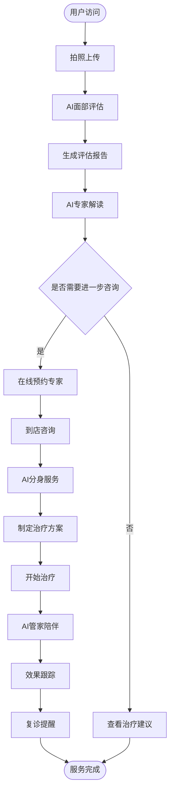
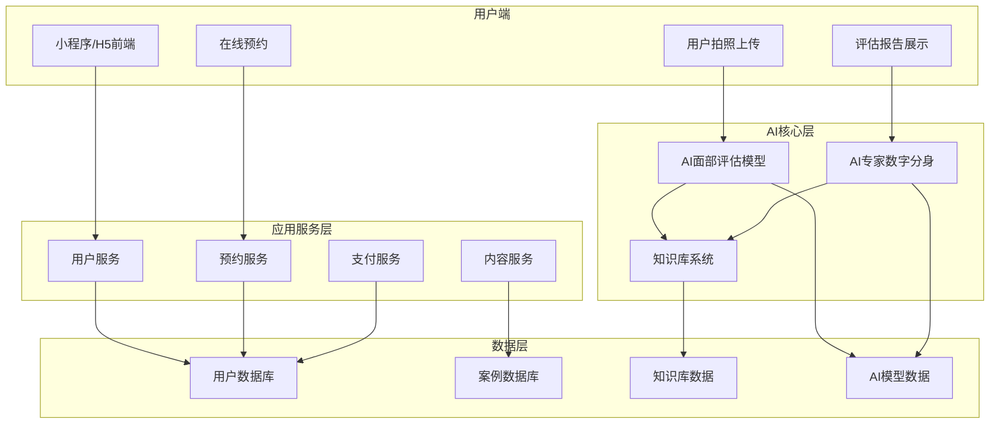

# AI颜值管家产品需求文档 (PRD)

## 文档信息
- **产品名称**: AI颜值管家
- **版本**: v2.0（页面原型设计版）
- **创建日期**: 2024年12月
- **文档状态**: 功能设计与页面原型规划
- **设计目标**: 完整的前台+后台页面demo原型

---

## 📑 目录

1. [项目概述](#1-项目概述)
   - 1.1 产品定位
   - 1.2 目标用户
   - 1.3 核心价值主张

2. [前台系统功能设计](#2-前台系统功能设计) ⭐
   - 2.1 小程序/H5端功能
   - 2.2 到店咨询大屏端功能
   - 2.3 业务流程图

3. [后台管理系统功能设计](#3-后台管理系统功能设计) ⭐
   - 3.1 用户管理系统
   - 3.2 内容管理系统(CMS)
   - 3.3 数据运营与分析平台
   - 3.4 系统管理与配置
   - 3.5 知识库与内容维护系统

4. [前后台系统对比](#4-前后台系统对比)
   - 4.1 系统定位对比
   - 4.2 功能模块对比
   - 4.3 用户角色与权限
   - 4.4 页面数量预估

5. [页面原型设计规划](#5-页面原型设计规划)
   - 5.1 前台页面清单
   - 5.2 后台页面清单
   - 5.3 设计优先级
   - 5.4 里程碑规划

6. [附录](#6-附录)
   - 6.1 竞品分析
   - 6.2 合规要求
   - 6.3 文档版本记录

---

## 1. 项目概述

### 1.1 产品定位
AI颜值管家是一个基于人工智能技术的面部抗衰评估和咨询平台，通过AI专家数字分身为用户提供专业的面部评估、个性化治疗方案推荐和全流程服务体验。

### 1.2 目标用户
- **主要用户**: 25-45岁关注面部抗衰的女性用户
- **高净值用户**: 有一定经济实力，追求专业医美服务的用户
- **潜在用户**: 对医美感兴趣但缺乏专业指导的用户群体

### 1.3 核心价值主张
- 提供专业、客观的面部抗衰评估
- 7x24小时AI专家陪伴服务
- 科学权威的医美知识科普
- 全流程个性化治疗方案

## 2. 功能架构

### 2.1 AI核心建设（底层能力）

#### 2.1.1 知识库构建
**功能描述**: 构建专业的面部抗衰知识库，确保AI评估的专业性和权威性

**核心要求**:
- 客观、权威、用户有用、时效性
- 结构化处理3000+病例数据
- 专家访谈转化诊疗逻辑、SOP、沟通风格
- 实时数据更新，推动AI智能体调优进化

**数据来源**:
1. **内部数据治理**
   - 3000+病例数据结构化处理
   - 专家访谈知识转化
   - 面部抗衰诊疗逻辑标准化
   - SOP流程规范化

2. **外部数据补充**
   - 用户痛点&槽点抓取分析
   - 爆款推文视频内容分析
   - 小红书种草、抖音&视频号推广脚本生成
   - 权威期刊、论文、研究数据引入

**预期工期**: 20-30人日

#### 2.1.2 AI面部评估模型 (1.0)
**功能描述**: 基于专家知识库训练的面部评估AI模型

**技术要求**:
- 根据交互需要、数据特点和成本控制确认模型选型
- 架构设计优化
- 面部下垂、肌肤状态等关键指标评估
- 评估报告专业性与准确性保障

**评估维度**:
- 面部下垂程度
- 肌肤状态（皱纹、松弛、色斑等）
- 面部轮廓分析
- 整体抗衰建议

**预期工期**: 40-50人日

#### 2.1.3 AI专家数字分身模型 (2.0)
**功能描述**: 融合金牌销售&客服及顶级专家知识与沟通风格的AI智能体

**核心能力**:
- 深度互动问答
- 报告解读服务
- 高净值客户转化
- 人机协同服务

**技术特点**:
- 多模态交互（文本、语音、图像）
- 个性化沟通风格
- 专业知识问答
- 情感化服务体验

**预期工期**: 50-60人日

---

### 2.2 前台系统（面向终端用户）

> **用户角色**: 25-45岁关注面部抗衰的终端用户（包括新用户、活跃用户、高价值用户）
> 
> **核心价值**: 提供便捷的AI颜值评估、专家咨询、预约服务和个性化内容推荐

#### 2.2.1 "真美"AI颜值管家小程序/H5（移动端）

**功能描述**: 用户前端应用，提供核心服务入口和线上获客能力

**核心功能模块**:

1. **用户注册与登录**
   - 手机号注册/登录
   - 微信一键登录
   - 用户协议与隐私政策
   - 实名认证（可选）

2. **面部拍照上传**
   - 多角度面部照片拍摄引导（正面、侧面、45度角）
   - 图片质量检测与优化
   - 光线和角度智能提示
   - 照片隐私保护机制
   - 历史照片管理

3. **AI颜值评估**
   - 一键提交评估申请
   - 评估进度实时显示
   - 评估结果推送通知

4. **评估报告可视化展示**
   - 3D面部模型重建
   - 问题区域智能标注（色斑、皱纹、松弛等）
   - 分数评估与同龄对比
   - 改善建议分阶段展示
   - 前后对比效果预览
   - 报告下载与分享

5. **AI专家智能问答**
   - 7x24小时在线咨询
   - 文字/语音多模态交互
   - 报告详细解读
   - 抗衰知识科普
   - 治疗方案推荐

6. **在线预约服务**
   - 专家时间查询与预约
   - 到店服务项目选择
   - 预约确认与支付
   - 预约提醒（微信通知）
   - 预约改期/取消

7. **个人中心**
   - 我的评估报告
   - 我的预约记录
   - 我的治疗计划
   - 我的收藏与关注
   - 账户设置

8. **内容社区**
   - 个性化内容推荐
   - 科学抗衰科普文章
   - 真实案例分享
   - 专家视频内容
   - 用户评价与互动

9. **营销活动**
   - 新人优惠活动
   - 限时优惠推送
   - 好友邀请奖励
   - 积分兑换体系

10. **社交分享**
    - 评估结果分享（脱敏）
    - 治疗历程记录分享
    - 邀请好友体验
    - 内容转发到社交平台

**预期工期**: 45-55人日

#### 2.2.2 AI专家分身到店咨询系统（线下触点）

**功能描述**: 咨询室交互界面，提升到店体验和高客单转化

**核心功能**:

1. **欢迎与身份识别**
   - 用户到店自动识别
   - 预约信息调取
   - 个性化欢迎语

2. **AI分身主导报告解读**
   - 全息投影显示AI专家形象
   - 3D面部模型大屏展示
   - AI专家语音讲解报告
   - 实时互动问答
   - 治疗方案推荐

3. **人机协同服务流程**
   - 复杂问题自动转接真人专家
   - 专家与AI协同服务
   - 方案讨论与确认
   - 个性化定制服务
   - 价格方案展示

4. **硬件集成**
   - 全息设备接口
   - 高清显示设备
   - 语音交互设备
   - 触控屏幕支持

5. **服务记录**
   - 咨询内容自动记录
   - 服务满意度评价
   - 后续跟进提醒

**预期工期**: 25-30人日

#### 2.2.3 AI管家主动陪伴系统（后端服务）

**功能描述**: 用户全生命周期智能陪伴，提升用户留存和复购

**核心功能**:

1. **治疗计划管理**
   - 个性化治疗方案制定
   - 治疗进度跟踪
   - 阶段性效果评估
   - 方案动态调整

2. **智能提醒系统**
   - 用药时间提醒
   - 复诊时间安排
   - 注意事项推送
   - 生活建议推送（饮食、护肤等）

3. **主动关怀**
   - 术后关怀回访
   - 节日祝福推送
   - 生日专属优惠
   - 效果跟踪反馈

4. **人机协同转接逻辑**
   - 智能识别复杂问题
   - 高意向用户自动标记
   - 自动转接真人专家
   - 无缝服务体验

**预期工期**: 25-30人日

---

### 2.3 后台管理系统（面向管理人员/数据管理员）

> **用户角色**: 平台运营人员、数据分析师、医疗专家、客服主管、管理员
> 
> **核心价值**: 实现数据驱动的智能运营、用户管理、内容管理和业务分析

#### 2.3.1 用户管理系统

**功能描述**: 全面管理用户信息、行为和状态

**核心功能**:

1. **用户信息管理**
   - 用户基本资料查看/编辑
   - 用户认证状态管理
   - 用户标签管理
   - 用户黑名单管理

2. **用户行为分析**
   - 用户访问轨迹查看
   - 评估记录查询
   - 咨询记录查询
   - 预约历史查询

3. **用户分层运营**
   - 用户画像标签化
   - 用户分群管理
   - 高价值用户识别
   - 流失用户预警

4. **客户关系管理（CRM）**
   - 客户跟进记录
   - 销售漏斗管理
   - 转化率统计
   - 客服工单管理

**预期工期**: 20-25人日

#### 2.3.2 内容管理系统（CMS）

**功能描述**: 管理前台展示的所有内容和营销物料

**核心功能**:

1. **文章内容管理**
   - 科普文章发布/编辑
   - 案例内容管理
   - 专家内容审核
   - 内容分类与标签

2. **多媒体管理**
   - 图片素材库
   - 视频内容管理
   - 3D模型资源管理

3. **营销活动管理**
   - 活动创建与配置
   - 优惠券管理
   - 推送消息管理
   - Banner广告位管理

4. **内容推荐配置**
   - 推荐算法参数调整
   - 个性化内容策略
   - A/B测试管理

**预期工期**: 18-22人日

#### 2.3.3 数据运营与分析平台

**功能描述**: 数据驱动的智能运营决策支持系统

**核心功能**:

1. **业务数据看板**
   - 实时用户数据（注册、活跃、留存）
   - 业务数据监控（评估量、咨询量、预约量）
   - 收入数据统计
   - 关键指标趋势图

2. **转化漏斗分析**
   - 用户转化路径可视化
   - 各环节转化率分析
   - 关键节点优化建议
   - 流失原因分析

3. **案例归档管理**
   - 用户案例存储与检索
   - 治疗前后对比记录
   - 治疗效果评估
   - 专家评价系统
   - 案例脱敏处理

4. **AI模型效果监控**
   - 评估准确率统计
   - AI响应时间监控
   - 用户满意度追踪
   - 模型迭代效果对比

5. **高意向客户识别**
   - 客户意向度评分模型
   - 高意向客户列表
   - 自动提醒跟进
   - 转化成功率统计

6. **运营报表生成**
   - 日报/周报/月报自动生成
   - 自定义报表配置
   - 数据导出功能
   - ROI分析报告

**预期工期**: 30-35人日

#### 2.3.4 系统管理与配置

**功能描述**: 系统底层配置和权限管理

**核心功能**:

1. **权限管理**
   - 角色权限配置（运营、客服、管理员、数据分析师等）
   - 用户账号管理
   - 操作日志记录
   - 敏感操作审计

2. **系统配置**
   - 基础参数设置
   - 第三方服务配置（支付、短信、云存储等）
   - API接口管理
   - 系统监控告警

3. **专家管理**
   - 专家信息维护
   - 专家排班管理
   - 专家评价管理
   - 服务配置

**预期工期**: 15-20人日

#### 2.3.5 知识库与内容维护系统 ⭐

**功能描述**: AI智能的核心驱动力，管理和维护所有知识内容，确保AI回答的准确性和专业性

**核心功能**:

1. **专家知识库管理**
   - 专家知识条目录入/编辑
   - 知识分类与标签体系
   - 知识关联关系管理
   - 多维度知识检索
   - 知识质量评分
   - 知识引用统计

2. **诊疗SOP维护**
   - 诊疗流程标准化管理
   - 各项目SOP文档编辑
   - SOP版本管理与对比
   - SOP执行效果追踪
   - SOP优化建议收集

3. **FAQ知识库管理**
   - 常见问题库维护
   - 问题分类与标签
   - 标准答案编辑
   - 相似问题关联
   - 问题命中率统计
   - 未知问题收集与整理

4. **医美知识内容库**
   - 专业术语词典管理
   - 抗衰知识条目管理
   - 治疗方法知识库
   - 产品成分知识库
   - 医学文献资料库
   - 行业标准与规范

5. **案例知识库**
   - 典型案例归档
   - 案例标签与分类
   - 案例知识提取
   - 成功经验沉淀
   - 失败案例警示

6. **知识审核流程**
   - 知识提交审核机制
   - 多级审核流程配置
   - 专家审核意见记录
   - 审核通过/驳回管理
   - 审核历史追溯

7. **知识版本控制**
   - 知识变更历史记录
   - 版本对比与回滚
   - 变更原因说明
   - 版本发布管理
   - 灰度发布控制

8. **知识效果评估**
   - AI引用知识统计
   - 知识有效性评估
   - 用户满意度关联
   - 无效知识识别
   - 知识缺口分析
   - 优化建议生成

9. **知识导入导出**
   - 批量知识导入（Excel/CSV）
   - 知识模板下载
   - 知识数据导出
   - 第三方知识库对接

10. **知识协同编辑**
    - 多人协同编辑
    - 编辑权限控制
    - 编辑冲突处理
    - 评论与讨论功能
    - @专家协作

**预期工期**: 25-30人日

**重要性说明**: 
- 知识库是AI系统的"大脑"，直接影响AI回答质量
- 需要医疗专家、运营人员、AI工程师协同维护
- 建议配置专职知识管理员角色

---

### 2.4 系统集成与部署

#### 2.4.1 测试与上线
**功能描述**: 系统测试与平台部署

**测试内容**:
1. **功能测试**
   - 核心功能验证
   - 用户体验测试
   - 兼容性测试

2. **压力测试**
   - 并发用户测试
   - 系统性能测试
   - 稳定性测试

3. **AI模型效果评测**
   - 评估准确性测试
   - 响应时间测试
   - 用户满意度调研

4. **平台部署上线**
   - 小程序/H5平台部署
   - 服务器配置优化
   - 监控系统搭建

**预期工期**: 30人日

## 3. 技术架构

### 3.1 技术选型

#### 3.1.1 前台技术栈
- **移动端**: 微信小程序原生开发 / uniapp跨平台
- **H5**: Vue.js 3.x + TypeScript + Vite
- **UI框架**: Vant UI / TDesign
- **3D渲染**: Three.js / WebGL
- **状态管理**: Pinia / Vuex
- **HTTP客户端**: Axios

#### 3.1.2 后台管理系统技术栈
- **前端框架**: Vue.js 3.x + Element Plus / Ant Design Vue
- **可视化**: ECharts / D3.js
- **表格组件**: Vxe-table
- **富文本编辑器**: TinyMCE / Quill

#### 3.1.3 后端技术栈
- **框架**: Spring Boot / Node.js (Express/Nest.js)
- **架构**: 微服务架构，支持高并发
- **API网关**: Spring Cloud Gateway / Kong
- **消息队列**: RabbitMQ / Kafka
- **缓存**: Redis
- **数据库**: MySQL (主业务) + MongoDB (日志/非结构化数据)
- **对象存储**: 阿里云OSS / 腾讯云COS

#### 3.1.4 AI技术栈
- **AI模型**: 深度学习 + 专家知识库
- **训练框架**: TensorFlow / PyTorch
- **模型服务**: TensorFlow Serving / TorchServe
- **NLP**: OpenAI API / 本地大模型（ChatGLM、Qwen等）
- **计算机视觉**: OpenCV + 自研模型

#### 3.1.5 基础设施
- **云服务**: 阿里云 / 腾讯云 / AWS
- **容器化**: Docker + Kubernetes
- **CI/CD**: Jenkins / GitLab CI
- **监控**: Prometheus + Grafana
- **日志**: ELK Stack

### 3.2 系统架构

```
┌──────────────────────────────────────────────────────────────┐
│                        前台系统（终端用户）                      │
├──────────────────────────────────────────────────────────────┤
│  小程序/H5端          到店咨询终端           移动App(未来)      │
│  · 用户注册登录        · 全息投影界面        · iOS/Android    │
│  · 拍照评估           · 大屏展示                              │
│  · AI问答咨询         · 触控交互                              │
│  · 在线预约           · 人机协同                              │
│  · 内容社区                                                   │
└──────────────────────────────────────────────────────────────┘
                              ↓
┌──────────────────────────────────────────────────────────────┐
│                        API网关层                              │
│  · 请求路由  · 鉴权认证  · 流量控制  · 负载均衡               │
└──────────────────────────────────────────────────────────────┘
                              ↓
┌──────────────────────────────────────────────────────────────┐
│                     微服务集群（业务层）                       │
├──────────────────────────────────────────────────────────────┤
│  用户服务    AI评估服务    咨询服务    预约服务    内容服务    │
│  订单服务    支付服务      消息服务    推荐服务    搜索服务    │
└──────────────────────────────────────────────────────────────┘
         ↓                    ↓                    ↓
┌─────────────────┐  ┌─────────────────┐  ┌─────────────────┐
│   AI服务层      │  │   数据存储层    │  │  后台管理系统   │
│                 │  │                 │  │  (管理人员)     │
│ · AI面部评估    │  │ · MySQL(业务)   │  │                 │
│ · AI专家分身    │  │ · MongoDB(日志) │  │ · 用户管理      │
│ · NLP对话引擎   │  │ · Redis(缓存)   │  │ · 内容管理(CMS) │
│ · 推荐算法      │  │ · OSS(文件)     │  │ · 数据分析      │
│ · 知识库        │  │ · 向量数据库    │  │ · 系统配置      │
│                 │  │                 │  │ · 权限管理      │
└─────────────────┘  └─────────────────┘  └─────────────────┘
                              ↓
┌──────────────────────────────────────────────────────────────┐
│                      基础设施层                               │
│  云服务器  ·  GPU资源  ·  CDN  ·  监控告警  ·  日志分析      │
└──────────────────────────────────────────────────────────────┘
```

### 3.3 工程架构说明

#### 3.3.1 系统分端概览

从页面功能层面，系统分为 **4个前端应用** 和 **9个后端微服务**：

**前端应用（4个端）**：

| 端 | 工程名称 | 技术栈 | 用户角色 | 页面数量 | 优先级 |
|----|---------|--------|---------|---------|--------|
| 小程序端 | ai-beauty-miniprogram | 微信小程序/uniapp | C端用户 | 20-30页 | P0 |
| H5移动端 | ai-beauty-h5 | Vue3 + Vite + Vant | C端用户 | 15-20页 | P0 |
| 到店大屏 | ai-beauty-store-screen | Vue3 + Three.js | C端用户（线下） | 5-8界面 | P1 |
| 后台管理 | ai-beauty-admin | Vue3 + Element Plus | B端管理员 | 40-50页 | P0 |

**后端微服务（9个）**：

| 服务 | 工程名称 | 技术栈 | 功能职责 | 优先级 |
|-----|---------|--------|---------|--------|
| API网关 | api-gateway | Spring Cloud Gateway | 路由、鉴权、限流 | P0 |
| 用户服务 | user-service | Spring Boot/Node.js | 用户管理、认证 | P0 |
| AI评估 | ai-assessment-service | Python + FastAPI | 面部评估 | P0 |
| AI对话 | ai-chatbot-service | Python + LangChain | AI问答 | P0 |
| 内容服务 | content-service | Spring Boot/Node.js | 内容管理 | P1 |
| 预约服务 | booking-service | Spring Boot/Node.js | 预约管理 | P0 |
| 消息服务 | message-service | Spring Boot/Node.js | 消息推送 | P1 |
| 数据分析 | analytics-service | Python/Java | 数据分析 | P1 |
| 知识库 | knowledge-base-service | Python/Java | 知识管理 | P0 |

**总计：13个独立工程**（MVP阶段可简化为6个）

#### 3.3.2 前端代码复用策略

1. **小程序 + H5 统一开发**
   - 推荐使用 uniapp 或 Taro 框架
   - 一套代码编译为小程序和H5
   - 共用组件库、API封装、状态管理

2. **公共模块抽离**
   - `common` 包：工具函数、常量、类型定义
   - `api` 包：统一API调用封装
   - `components` 包：通用组件库

3. **组件库选型**
   - C端（小程序/H5）：Vant UI / TDesign
   - B端（后台管理）：Element Plus / Ant Design Vue
   - 到店大屏：自定义炫酷组件 + Three.js

#### 3.3.3 后端服务设计原则

1. **服务拆分原则**
   - 按业务领域拆分（DDD领域驱动设计）
   - 高内聚、低耦合
   - 独立部署、独立扩展

2. **服务间通信**
   - 同步调用：gRPC / REST API
   - 异步消息：RabbitMQ / Kafka
   - 服务发现：Nacos / Consul

3. **统一规范**
   - 统一日志格式（ELK）
   - 统一错误码体系
   - 统一API返回格式（RESTful）
   - 统一监控告警（Prometheus）

### 3.4 前后台交互流程

#### 3.4.1 用户评估流程（前台 → 后端 → AI）
```
用户拍照上传 
  → API网关鉴权 
  → 图片上传OSS 
  → AI评估服务调度 
  → 生成评估报告 
  → 存储数据库 
  → 前台展示结果
```

#### 3.4.2 后台数据分析流程（后台 → 数据层）
```
管理员登录后台 
  → 权限验证 
  → 查询业务数据 
  → 数据聚合计算 
  → 生成可视化图表 
  → 后台展示分析结果
```

#### 3.4.3 知识维护与AI优化流程 ⭐
```
【前台】用户咨询AI，AI无法准确回答
    ↓
【后台】系统记录未知问题到知识缺口列表
    ↓
【后台】知识管理员看到知识缺口提醒
    ↓
【后台】医疗专家编辑新的知识条目
    ↓
【后台】知识审核流程（多级审核）
    ↓
【后台】知识发布（支持灰度发布）
    ↓
【AI层】AI模型更新知识库
    ↓
【前台】用户再次提问，AI准确回答
    ↓
【后台】知识效果评估（统计引用次数、用户满意度）
```

### 3.5 业务流程图

#### 3.5.1 用户使用流程


#### 3.5.2 系统整体架构图


### 3.6 MVP阶段最小工程集

如果要快速验证商业模式，MVP阶段可以简化工程数量：

#### MVP最小集（6个工程）

**前端（2个）**：
1. ✅ 小程序/H5（合并为一个uniapp工程）- ai-beauty-miniprogram
2. ✅ 后台管理系统（简化版）- ai-beauty-admin

**后端（4个）**：
3. ✅ 用户服务（含API网关功能）- user-service
4. ✅ AI评估+对话服务（合并）- ai-service
5. ✅ 业务服务（合并预约、内容、消息）- business-service
6. ✅ 知识库服务 - knowledge-service

**MVP开发周期**：2-2.5个月（按5人团队）

**说明**：MVP阶段可以合并部分微服务，验证成功后再拆分细化。

### 3.7 技术选型方案对比

| 方案 | 前端技术 | 后端技术 | 优点 | 缺点 | 适用场景 |
|-----|---------|---------|------|------|---------|
| 方案一 | Vue.js | Node.js (Nest.js) | 前后端技术栈统一，团队协作效率高 | 大规模应用性能不如Java | 小团队、快速迭代 |
| 方案二 | Vue.js | Spring Boot/Cloud | 企业级、稳定性好、生态成熟 | 学习曲线陡峭 | 大型团队、长期维护 |
| 方案三 | Vue.js | Go (Gin) | 高性能、并发能力强 | 生态相对较小 | 高并发场景、追求性能 |

**推荐方案**：
- **AI服务**：统一使用 Python（AI生态最成熟）
- **业务服务**：根据团队技术栈选择 Node.js 或 Spring Boot
- **前端应用**：统一使用 Vue.js 3（生态成熟、易上手）

## 4. 运营策略

### 4.1 内容运营
- **科学科普内容**: 面部抗衰专业知识普及
- **名医堂医生推介**: 权威专家形象塑造
- **医美前沿科技**: 新技术、新方法介绍
- **Buying Journey**: 用户决策路径优化

### 4.2 渠道运营
- **小红书**: 种草内容营销
- **抖音**: 短视频推广
- **视频号**: 微信生态营销
- **私域流量**: 用户社群运营

### 4.3 用户运营
- **新用户**: 注册引导、首次评估优惠
- **活跃用户**: 个性化内容推荐、活动参与
- **高价值用户**: VIP服务、专属优惠
- **流失用户**: 挽回策略、重新激活

## 5. 前后台系统对比

### 5.1 系统定位对比

| 对比维度 | 前台系统（C端） | 后台管理系统（B端） |
|---------|---------------|-------------------|
| **目标用户** | 终端消费者（25-45岁女性用户） | 管理人员、运营人员、数据分析师 |
| **核心诉求** | 获取服务、便捷体验、专业咨询 | 数据分析、运营管理、效率提升 |
| **访问方式** | 小程序/H5/移动App | Web后台（PC端为主） |
| **使用频率** | 碎片化、高频（每天多次） | 持续工作、中频（工作时段） |
| **界面风格** | 简洁美观、易用性强、视觉吸引 | 功能丰富、信息密度高、专业严谨 |
| **主要操作** | 浏览、咨询、预约、分享 | 查询、分析、配置、管理、审核 |
| **数据权限** | 只能查看自己的数据 | 可查看所有用户数据（按权限） |
| **核心指标** | 用户体验、转化率、留存率 | 运营效率、数据准确性、决策支持 |
| **技术侧重** | 性能优化、视觉效果、响应速度 | 数据处理、权限控制、报表生成 |

### 5.2 功能模块对比

| 前台系统核心功能 | 后台管理系统核心功能 |
|----------------|-------------------|
| ✅ 用户注册登录 | ✅ 用户信息管理 |
| ✅ 面部拍照上传 | ✅ 用户行为分析 |
| ✅ AI颜值评估 | ✅ 用户分层运营 |
| ✅ 评估报告展示 | ✅ 客户关系管理(CRM) |
| ✅ AI专家问答 | ✅ 文章内容管理 |
| ✅ 在线预约服务 | ✅ 多媒体资源管理 |
| ✅ 个人中心 | ✅ 营销活动管理 |
| ✅ 内容社区 | ✅ 业务数据看板 |
| ✅ 营销活动参与 | ✅ 转化漏斗分析 |
| ✅ 社交分享 | ✅ 案例归档管理 |
| - | ✅ AI模型效果监控 |
| - | ✅ 高意向客户识别 |
| - | ✅ 运营报表生成 |
| - | ✅ **知识库维护系统** ⭐ |
| - | ✅ 权限管理 |
| - | ✅ 系统配置 |

### 6.3 用户角色与权限

#### 6.3.1 前台系统用户角色

| 角色 | 权限范围 | 主要功能 |
|-----|---------|---------|
| 普通用户 | 查看自己的数据 | 评估、咨询、预约、查看报告 |
| VIP会员 | 查看自己的数据 + 高级功能 | 优先预约、专属客服、会员内容 |

#### 6.3.2 后台系统用户角色

| 角色 | 权限范围 | 主要功能 |
|-----|---------|---------|
| 系统管理员 | 全部权限 | 系统配置、权限管理、所有功能 |
| 运营人员 | 内容、营销、用户管理 | 内容发布、活动配置、用户运营 |
| 数据分析师 | 数据查询、报表导出 | 数据分析、报表生成、转化分析 |
| 客服主管 | 用户管理、CRM | 客户跟进、工单管理、沟通记录 |
| 知识管理员 | 知识库维护 | 知识编辑、审核、版本控制 ⭐ |
| 医疗专家 | 知识审核、案例管理 | 知识审核、专业意见、案例评估 |

### 6.4 系统集成与数据流转

#### 6.4.1 前台依赖后台的场景
1. **用户数据**：用户信息由后台统一管理
2. **内容数据**：前台展示的内容由后台CMS发布
3. **营销活动**：前台的活动入口由后台配置
4. **专家资源**：前台的专家预约依赖后台排班数据
5. **AI知识库** ⭐：前台AI问答依赖后台知识库维护系统

#### 6.4.2 后台依赖前台的场景
1. **用户行为数据**：前台用户操作产生的数据供后台分析
2. **业务数据**：评估、咨询、预约数据来自前台
3. **反馈数据**：用户满意度、评价等反馈数据
4. **知识缺口数据** ⭐：前台AI无法回答的问题反馈到后台知识管理

#### 6.4.3 双向互动关键点
- 后台标记的高意向用户，会触发前台的精准推送
- 前台用户的投诉，会在后台生成工单
- **后台维护的知识库，会实时更新前台AI的回答能力** ⭐
- 前台AI的回答效果，会反馈到后台进行知识质量评估

## 7. 项目规划

### 7.1 开发阶段

**总工期预估**: 308-402人日

1. **第一阶段 - AI核心建设** (110-140人日)
   - 知识库构建: 20-30人日
   - AI面部评估模型: 40-50人日
   - AI专家数字分身模型: 50-60人日

2. **第二阶段 - 前台系统开发** (95-115人日)
   - "真美"小程序/H5: 45-55人日
   - AI专家分身到店咨询系统: 25-30人日
   - AI管家主动陪伴系统: 25-30人日

3. **第三阶段 - 后台管理系统开发** (108-132人日)
   - 用户管理系统: 20-25人日
   - 内容管理系统(CMS): 18-22人日
   - 数据运营与分析平台: 30-35人日
   - 系统管理与配置: 15-20人日
   - **知识库与内容维护系统: 25-30人日** ⭐

4. **第四阶段 - 系统集成与上线** (30人日)
   - 功能测试、压力测试
   - AI模型效果评测
   - 平台部署上线

**开发周期说明**：
- 按5人团队计算，约需62-80个工作日（3-4个月）
- 按8人团队计算，约需39-50个工作日（2-2.5个月）

### 7.2 里程碑规划
- **M1**: 知识库构建完成，AI评估模型v1.0上线
- **M2**: 前台小程序/H5上线，用户可使用基础评估和咨询功能
- **M3**: AI专家分身模型上线，到店咨询系统集成，线上线下打通
- **M4**: 后台管理系统上线，运营人员可进行数据驱动运营
- **M5**: 全系统测试完成，正式商业化运营

### 7.3 风险控制
- **技术风险**: AI模型准确性、系统稳定性
- **市场风险**: 用户接受度、竞品压力
- **运营风险**: 内容质量、用户留存
- **合规风险**: 医疗广告规范、数据隐私保护

## 8. 成功指标

### 8.1 用户指标
- **用户规模**: 商业化前完成5万会员
- **日活用户**: 目标日活5000-10000人
- **用户留存**: 月留存率>30%，年留存率>15%
- **用户满意度**: NPS评分>8.0

### 8.2 业务指标
- **转化率**: 评估用户到咨询转化率>20%
- **客单价**: 高净值用户平均客单价>5000元
- **复购率**: 治疗服务复购率>40%
- **收入目标**: 首年营收目标1000万+

### 8.3 技术指标
- **系统可用性**: 99.9%以上
- **响应时间**: 评估报告生成<3秒
- **并发支持**: 同时支持50-100人并发
- **AI准确率**: 面部评估准确率>90%

## 9. 附录

### 9.1 竞品分析
- **主要竞品**: 更美、新氧、悦美等医美平台
- **差异化优势**: AI专家分身、全流程陪伴、科学评估
- **竞争优势**: 专业性强、用户体验好、转化效率高

### 9.2 合规要求
- **医疗广告**: 严格遵守医疗广告法相关规定
- **数据保护**: 用户隐私数据加密存储
- **内容审核**: 所有内容需通过专业审核
- **资质要求**: 相关医疗咨询服务资质

### 9.3 技术债务
- **模型迭代**: AI模型需要持续优化升级
- **系统扩展**: 支持更大规模用户访问
- **功能完善**: 根据用户反馈持续功能迭代
- **性能优化**: 不断提升系统性能和用户体验

### 9.4 文档版本记录

| 版本 | 日期 | 更新内容 | 更新人 |
|-----|------|---------|-------|
| v1.0 | 2024-12 | 初始版本，完成基础PRD | - |
| v1.1 | 2024-12 | 重构功能架构，明确前后台划分，新增知识库维护系统 | - |
| v1.2 | 2024-12 | 整合工程架构说明、业务流程图、前后台对比等内容 | - |

---

**当前版本**: v1.2  
**最后更新**: 2024年12月  
**文档状态**: 详细设计完成  
**审核状态**: 待审核  
**下一步行动**:  
1. 技术方案详细设计
2. UI/UX设计稿输出
3. 开发团队组建
4. 第一阶段开发启动（AI核心建设）
