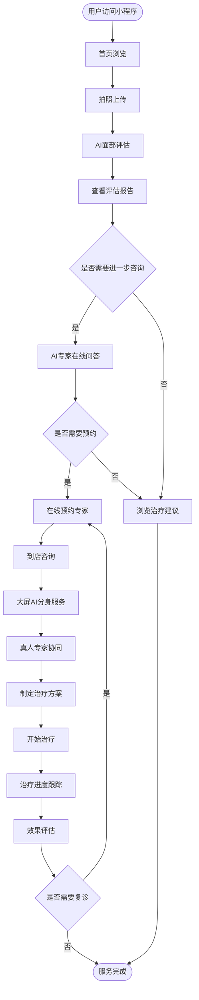

# AI颜值管家产品需求文档 (PRD) - 页面原型设计版

## 文档信息
- **产品名称**: AI颜值管家
- **版本**: v2.0（页面原型设计版）
- **创建日期**: 2024年12月
- **文档状态**: 功能设计与页面原型规划
- **设计目标**: 完整的前台+后台页面demo原型

---

## 📑 目录

1. [项目概述](#1-项目概述)
   - 1.1 产品定位
   - 1.2 目标用户
   - 1.3 核心价值主张

2. [前台系统功能设计](#2-前台系统功能设计) ⭐
   - 2.1 小程序/H5端功能与页面
   - 2.2 到店咨询大屏端功能与页面
   - 2.3 业务流程图

3. [后台管理系统功能设计](#3-后台管理系统功能设计) ⭐
   - 3.1 用户管理系统
   - 3.2 内容管理系统(CMS)
   - 3.3 数据运营与分析平台
   - 3.4 系统管理与配置
   - 3.5 知识库与内容维护系统

4. [前后台系统对比](#4-前后台系统对比)
   - 4.1 系统定位对比
   - 4.2 功能模块对比
   - 4.3 用户角色与权限
   - 4.4 页面数量预估

5. [页面原型设计规划](#5-页面原型设计规划)
   - 5.1 前台页面清单
   - 5.2 后台页面清单
   - 5.3 设计优先级
   - 5.4 里程碑规划

6. [附录](#6-附录)
   - 6.1 竞品分析
   - 6.2 合规要求
   - 6.3 文档版本记录

---

## 1. 项目概述

### 1.1 产品定位
AI颜值管家是一个基于人工智能技术的面部抗衰评估和咨询平台，通过AI专家数字分身为用户提供专业的面部评估、个性化治疗方案推荐和全流程服务体验。

### 1.2 目标用户
- **主要用户**: 25-45岁关注面部抗衰的女性用户
- **高净值用户**: 有一定经济实力，追求专业医美服务的用户
- **潜在用户**: 对医美感兴趣但缺乏专业指导的用户群体

### 1.3 核心价值主张
- 提供专业、客观的面部抗衰评估
- 7x24小时AI专家陪伴服务
- 科学权威的医美知识科普
- 全流程个性化治疗方案

---

## 2. 前台系统功能设计

> **用户角色**: 25-45岁关注面部抗衰的终端用户
>
> **核心目标**: 提供便捷的AI颜值评估、专家咨询、预约服务和个性化内容推荐

### 2.1 小程序/H5端功能与页面

#### 2.1.1 用户注册与登录模块

**页面列表**：
1. **登录页** - 手机号登录/微信一键登录
2. **注册页** - 手机号注册、验证码验证
3. **用户协议页** - 用户协议与隐私政策

**核心功能**：
- 手机号注册/登录
- 微信一键登录
- 用户协议与隐私政策展示
- 实名认证（可选）

---

#### 2.1.2 首页

**页面**: 首页
**核心功能**：
- 产品slogan与品牌展示
- 快速评估入口（CTA按钮）
- AI专家介绍
- 热门服务推荐
- 成功案例轮播
- 科普文章推荐
- 底部导航栏（首页、评估、社区、我的）

---

#### 2.1.3 面部评估模块

**页面列表**：
1. **拍照引导页** - 拍照说明、角度示意
2. **拍照页** - 相机调用、实时预览
3. **照片确认页** - 照片查看、重拍/确认
4. **评估等待页** - 评估进度展示、加载动画
5. **评估报告页** - 完整评估报告展示

**核心功能**：
- 多角度面部照片拍摄引导（正面、侧面、45度角）
- 图片质量检测与优化
- 光线和角度智能提示
- 照片隐私保护机制
- 历史照片管理
- 一键提交评估申请
- 评估进度实时显示
- 评估结果推送通知

---

#### 2.1.4 评估报告模块

**页面列表**：
1. **报告首页** - 评分、总体评价
2. **问题详情页** - 各个问题区域详细说明
3. **改善建议页** - 分阶段治疗建议
4. **前后对比页** - 预期效果展示
5. **报告分享页** - 分享设置、海报生成

**核心功能**：
- 3D面部模型重建
- 问题区域智能标注（色斑、皱纹、松弛等）
- 分数评估与同龄对比
- 改善建议分阶段展示
- 前后对比效果预览
- 报告下载与分享

---

#### 2.1.5 AI专家问答模块

**页面列表**：
1. **对话首页** - 对话历史列表
2. **对话详情页** - 与AI专家聊天界面
3. **报告解读页** - 基于报告的专项解读

**核心功能**：
- 7x24小时在线咨询
- 文字/语音多模态交互
- 报告详细解读
- 抗衰知识科普
- 治疗方案推荐
- 对话历史保存

---

#### 2.1.6 在线预约模块

**页面列表**：
1. **专家列表页** - 可预约专家展示
2. **专家详情页** - 专家介绍、擅长领域
3. **预约日历页** - 可约时间选择
4. **服务项目页** - 服务项目选择
5. **预约确认页** - 订单信息确认
6. **支付页** - 支付方式选择
7. **预约成功页** - 预约信息展示
8. **预约管理页** - 预约记录、改期/取消

**核心功能**：
- 专家时间查询与预约
- 到店服务项目选择
- 预约确认与支付
- 预约提醒（微信通知）
- 预约改期/取消

---

#### 2.1.7 个人中心模块

**页面列表**：
1. **个人中心首页** - 用户信息、功能入口
2. **个人资料页** - 编辑个人信息
3. **我的评估报告** - 历史报告列表
4. **我的预约页** - 预约记录列表
5. **我的治疗计划** - 治疗进度跟踪
6. **我的收藏页** - 收藏的文章/案例
7. **账户设置页** - 隐私设置、通知设置
8. **关于我们页** - 公司介绍、联系方式

**核心功能**：
- 我的评估报告
- 我的预约记录
- 我的治疗计划
- 我的收藏与关注
- 账户设置

---

#### 2.1.8 内容社区模块

**页面列表**：
1. **社区首页** - 推荐内容Feed流
2. **文章详情页** - 科普文章阅读
3. **案例详情页** - 真实案例查看
4. **视频播放页** - 专家视频内容
5. **评论页** - 用户评论与互动
6. **搜索页** - 内容搜索

**核心功能**：
- 个性化内容推荐
- 科学抗衰科普文章
- 真实案例分享
- 专家视频内容
- 用户评价与互动

---

#### 2.1.9 营销活动模块

**页面列表**：
1. **活动列表页** - 进行中的活动
2. **活动详情页** - 活动规则说明
3. **优惠券页** - 可用/已用优惠券
4. **积分商城页** - 积分兑换
5. **邀请好友页** - 邀请海报、奖励规则

**核心功能**：
- 新人优惠活动
- 限时优惠推送
- 好友邀请奖励
- 积分兑换体系

---

#### 2.1.10 社交分享模块

**核心功能**：
- 评估结果分享（脱敏）
- 治疗历程记录分享
- 邀请好友体验
- 内容转发到社交平台

---

### 2.2 到店咨询大屏端功能与页面

> **使用场景**: 用户到店后，在咨询室通过大屏进行AI专家咨询
> 
> **特点**: 大屏展示、视觉震撼、全息投影、触控交互

#### 2.2.1 大屏端页面列表

1. **欢迎页** - 用户到店识别、欢迎语
2. **用户信息页** - 用户基本信息调取
3. **报告展示页** - 3D面部模型大屏展示
4. **AI解读页** - AI专家全息投影讲解
5. **互动问答页** - 触控/语音交互
6. **方案推荐页** - 治疗方案展示
7. **人工接入页** - 真人专家接入界面
8. **满意度评价页** - 服务评价

#### 2.2.2 核心功能

1. **欢迎与身份识别**
   - 用户到店自动识别
   - 预约信息调取
   - 个性化欢迎语

2. **AI分身主导报告解读**
   - 全息投影显示AI专家形象
   - 3D面部模型大屏展示
   - AI专家语音讲解报告
   - 实时互动问答
   - 治疗方案推荐

3. **人机协同服务流程**
   - 复杂问题自动转接真人专家
   - 专家与AI协同服务
   - 方案讨论与确认
   - 个性化定制服务
   - 价格方案展示

4. **服务记录**
   - 咨询内容自动记录
   - 服务满意度评价
   - 后续跟进提醒

---

### 2.3 业务流程图

#### 2.3.1 用户使用完整流程



#### 2.3.2 小程序使用流程

```
用户打开小程序
    ↓
首页浏览（了解产品）
    ↓
点击"立即评估"
    ↓
拍摄面部照片（引导）
    ↓
上传照片
    ↓
等待AI评估（30秒-1分钟）
    ↓
查看评估报告
    ↓
【分支1】AI专家在线咨询
【分支2】浏览科普内容
【分支3】在线预约专家
    ↓
形成转化或留存
```

---

## 3. 后台管理系统功能设计

> **用户角色**: 平台运营人员、数据分析师、医疗专家、客服主管、知识管理员、系统管理员
> 
> **核心目标**: 实现数据驱动的智能运营、用户管理、内容管理和业务分析

### 3.1 用户管理系统

#### 3.1.1 页面列表

1. **用户列表页** - 所有用户展示、筛选、搜索
2. **用户详情页** - 用户完整信息展示
3. **用户编辑页** - 编辑用户信息
4. **用户标签管理页** - 标签分类、新建标签
5. **黑名单管理页** - 黑名单用户列表
6. **用户行为分析页** - 单个用户行为轨迹
7. **用户分群页** - 用户分群创建与管理
8. **CRM客户管理页** - 客户跟进记录
9. **工单管理页** - 客服工单列表与详情

#### 3.1.2 核心功能

1. **用户信息管理**
   - 用户基本资料查看/编辑
   - 用户认证状态管理
   - 用户标签管理
   - 用户黑名单管理

2. **用户行为分析**
   - 用户访问轨迹查看
   - 评估记录查询
   - 咨询记录查询
   - 预约历史查询

3. **用户分层运营**
   - 用户画像标签化
   - 用户分群管理
   - 高价值用户识别
   - 流失用户预警

4. **客户关系管理（CRM）**
   - 客户跟进记录
   - 销售漏斗管理
   - 转化率统计
   - 客服工单管理

---

### 3.2 内容管理系统（CMS）

#### 3.2.1 页面列表

1. **内容列表页** - 所有内容展示（文章/案例/视频）
2. **文章编辑器页** - 富文本编辑器
3. **案例编辑页** - 案例内容编辑
4. **素材库页** - 图片/视频素材管理
5. **分类管理页** - 内容分类与标签
6. **审核列表页** - 待审核内容
7. **发布管理页** - 已发布内容管理
8. **营销活动配置页** - 活动创建与配置
9. **优惠券管理页** - 优惠券发放与管理
10. **推送消息页** - 消息推送配置
11. **Banner管理页** - 首页Banner配置

#### 3.2.2 核心功能

1. **文章内容管理**
   - 科普文章发布/编辑
   - 案例内容管理
   - 专家内容审核
   - 内容分类与标签

2. **多媒体管理**
   - 图片素材库
   - 视频内容管理
   - 3D模型资源管理

3. **营销活动管理**
   - 活动创建与配置
   - 优惠券管理
   - 推送消息管理
   - Banner广告位管理

4. **内容推荐配置**
   - 推荐算法参数调整
   - 个性化内容策略
   - A/B测试管理

---

### 3.3 数据运营与分析平台

#### 3.3.1 页面列表

1. **数据看板页** - 核心数据总览
2. **用户分析页** - 用户数据详细分析
3. **业务分析页** - 业务数据分析
4. **转化漏斗页** - 转化路径可视化
5. **案例归档页** - 案例库管理
6. **效果对比页** - 治疗前后效果
7. **AI效果监控页** - AI模型效果统计
8. **高意向客户页** - 高意向客户列表
9. **报表中心页** - 各类报表下载
10. **自定义报表页** - 自定义报表配置

#### 3.3.2 核心功能

1. **业务数据看板**
   - 实时用户数据（注册、活跃、留存）
   - 业务数据监控（评估量、咨询量、预约量）
   - 收入数据统计
   - 关键指标趋势图

2. **转化漏斗分析**
   - 用户转化路径可视化
   - 各环节转化率分析
   - 关键节点优化建议
   - 流失原因分析

3. **案例归档管理**
   - 用户案例存储与检索
   - 治疗前后对比记录
   - 治疗效果评估
   - 专家评价系统
   - 案例脱敏处理

4. **AI模型效果监控**
   - 评估准确率统计
   - AI响应时间监控
   - 用户满意度追踪
   - 模型迭代效果对比

5. **高意向客户识别**
   - 客户意向度评分模型
   - 高意向客户列表
   - 自动提醒跟进
   - 转化成功率统计

6. **运营报表生成**
   - 日报/周报/月报自动生成
   - 自定义报表配置
   - 数据导出功能
   - ROI分析报告

---

### 3.4 系统管理与配置

#### 3.4.1 页面列表

1. **角色管理页** - 角色列表与权限配置
2. **账号管理页** - 管理员账号管理
3. **权限配置页** - 菜单权限配置
4. **操作日志页** - 系统操作记录
5. **系统参数页** - 基础参数设置
6. **第三方配置页** - 三方服务配置
7. **API管理页** - API接口管理
8. **监控告警页** - 系统监控与告警
9. **专家管理页** - 专家信息维护
10. **排班管理页** - 专家排班设置

#### 3.4.2 核心功能

1. **权限管理**
   - 角色权限配置（运营、客服、管理员、数据分析师等）
   - 用户账号管理
   - 操作日志记录
   - 敏感操作审计

2. **系统配置**
   - 基础参数设置
   - 第三方服务配置（支付、短信、云存储等）
   - API接口管理
   - 系统监控告警

3. **专家管理**
   - 专家信息维护
   - 专家排班管理
   - 专家评价管理
   - 服务配置

---

### 3.5 知识库与内容维护系统 ⭐

> **重要性**: 知识库是AI系统的"大脑"，直接影响AI回答质量

#### 3.5.1 页面列表

1. **知识库首页** - 知识概览与统计
2. **知识列表页** - 所有知识条目
3. **知识编辑器页** - 知识条目编辑
4. **知识分类页** - 分类与标签管理
5. **SOP管理页** - 诊疗SOP文档
6. **FAQ管理页** - 常见问题库
7. **医美词典页** - 专业术语管理
8. **案例知识库页** - 典型案例管理
9. **知识审核页** - 审核工作流
10. **版本管理页** - 知识版本控制
11. **效果评估页** - 知识引用统计
12. **缺口分析页** - 知识缺口识别
13. **导入导出页** - 批量导入导出

#### 3.5.2 核心功能

1. **专家知识库管理**
   - 专家知识条目录入/编辑
   - 知识分类与标签体系
   - 知识关联关系管理
   - 多维度知识检索
   - 知识质量评分
   - 知识引用统计

2. **诊疗SOP维护**
   - 诊疗流程标准化管理
   - 各项目SOP文档编辑
   - SOP版本管理与对比
   - SOP执行效果追踪
   - SOP优化建议收集

3. **FAQ知识库管理**
   - 常见问题库维护
   - 问题分类与标签
   - 标准答案编辑
   - 相似问题关联
   - 问题命中率统计
   - 未知问题收集与整理

4. **医美知识内容库**
   - 专业术语词典管理
   - 抗衰知识条目管理
   - 治疗方法知识库
   - 产品成分知识库
   - 医学文献资料库
   - 行业标准与规范

5. **案例知识库**
   - 典型案例归档
   - 案例标签与分类
   - 案例知识提取
   - 成功经验沉淀
   - 失败案例警示

6. **知识审核流程**
   - 知识提交审核机制
   - 多级审核流程配置
   - 专家审核意见记录
   - 审核通过/驳回管理
   - 审核历史追溯

7. **知识版本控制**
   - 知识变更历史记录
   - 版本对比与回滚
   - 变更原因说明
   - 版本发布管理
   - 灰度发布控制

8. **知识效果评估**
   - AI引用知识统计
   - 知识有效性评估
   - 用户满意度关联
   - 无效知识识别
   - 知识缺口分析
   - 优化建议生成

9. **知识导入导出**
   - 批量知识导入（Excel/CSV）
   - 知识模板下载
   - 知识数据导出
   - 第三方知识库对接

10. **知识协同编辑**
    - 多人协同编辑
    - 编辑权限控制
    - 编辑冲突处理
    - 评论与讨论功能
    - @专家协作

---

## 4. 前后台系统对比

### 4.1 系统定位对比

| 对比维度 | 前台系统（C端） | 后台管理系统（B端） |
|---------|---------------|-------------------|
| **目标用户** | 终端消费者（25-45岁女性用户） | 管理人员、运营人员、数据分析师 |
| **核心诉求** | 获取服务、便捷体验、专业咨询 | 数据分析、运营管理、效率提升 |
| **访问方式** | 小程序/H5/移动App | Web后台（PC端为主） |
| **使用频率** | 碎片化、高频（每天多次） | 持续工作、中频（工作时段） |
| **界面风格** | 简洁美观、易用性强、视觉吸引 | 功能丰富、信息密度高、专业严谨 |
| **主要操作** | 浏览、咨询、预约、分享 | 查询、分析、配置、管理、审核 |
| **数据权限** | 只能查看自己的数据 | 可查看所有用户数据（按权限） |
| **核心指标** | 用户体验、转化率、留存率 | 运营效率、数据准确性、决策支持 |

### 4.2 功能模块对比

| 前台系统核心功能 | 后台管理系统核心功能 |
|----------------|-------------------|
| ✅ 用户注册登录 | ✅ 用户信息管理 |
| ✅ 面部拍照上传 | ✅ 用户行为分析 |
| ✅ AI颜值评估 | ✅ 用户分层运营 |
| ✅ 评估报告展示 | ✅ 客户关系管理(CRM) |
| ✅ AI专家问答 | ✅ 文章内容管理 |
| ✅ 在线预约服务 | ✅ 多媒体资源管理 |
| ✅ 个人中心 | ✅ 营销活动管理 |
| ✅ 内容社区 | ✅ 业务数据看板 |
| ✅ 营销活动参与 | ✅ 转化漏斗分析 |
| ✅ 社交分享 | ✅ 案例归档管理 |
| - | ✅ AI模型效果监控 |
| - | ✅ 高意向客户识别 |
| - | ✅ 运营报表生成 |
| - | ✅ **知识库维护系统** ⭐ |
| - | ✅ 权限管理 |
| - | ✅ 系统配置 |

### 4.3 用户角色与权限

#### 4.3.1 前台系统用户角色

| 角色 | 权限范围 | 主要功能 |
|-----|---------|---------|
| 普通用户 | 查看自己的数据 | 评估、咨询、预约、查看报告 |
| VIP会员 | 查看自己的数据 + 高级功能 | 优先预约、专属客服、会员内容 |

#### 4.3.2 后台系统用户角色

| 角色 | 权限范围 | 主要功能 | 可访问模块 |
|-----|---------|---------|-----------|
| 系统管理员 | 全部权限 | 系统配置、权限管理、所有功能 | 所有模块 |
| 运营人员 | 内容、营销、用户管理 | 内容发布、活动配置、用户运营 | CMS、营销、部分用户管理 |
| 数据分析师 | 数据查询、报表导出 | 数据分析、报表生成、转化分析 | 数据分析平台 |
| 客服主管 | 用户管理、CRM | 客户跟进、工单管理、沟通记录 | 用户管理、CRM |
| 知识管理员 | 知识库维护 | 知识编辑、审核、版本控制 ⭐ | 知识库系统 |
| 医疗专家 | 知识审核、案例管理 | 知识审核、专业意见、案例评估 | 知识库审核、案例管理 |

### 4.4 页面数量预估

| 系统 | 页面数量 | 说明 |
|-----|---------|------|
| **前台 - 小程序/H5** | **40-50个页面** | 包含所有功能模块的页面 |
| **前台 - 到店大屏** | **8-10个页面** | 专注于到店咨询场景 |
| **后台管理系统** | **60-80个页面** | 包含5大子系统的所有页面 |
| **合计** | **约110-140个页面** | 完整的页面demo原型 |

---

## 5. 页面原型设计规划

### 5.1 前台页面清单

#### 5.1.1 小程序/H5端（40-50页）

**基础模块（8页）**
1. 启动页/闪屏页
2. 登录页
3. 注册页
4. 用户协议页
5. 隐私政策页
6. 首页
7. 搜索页
8. 通知中心页

**评估模块（10页）**
9. 拍照引导页
10. 拍照页
11. 照片确认页
12. 历史照片管理页
13. 评估等待页
14. 评估报告首页
15. 问题详情页（色斑）
16. 问题详情页（皱纹）
17. 问题详情页（松弛）
18. 改善建议页
19. 前后对比页
20. 报告分享页

**AI问答模块（3页）**
21. 对话列表页
22. 对话详情页
23. 报告解读页

**预约模块（8页）**
24. 专家列表页
25. 专家详情页
26. 预约日历页
27. 服务项目页
28. 预约确认页
29. 支付页
30. 支付成功页
31. 预约管理页

**个人中心（8页）**
32. 个人中心首页
33. 个人资料页
34. 我的评估报告列表
35. 我的预约页
36. 我的治疗计划页
37. 我的收藏页
38. 账户设置页
39. 关于我们页

**内容社区（5页）**
40. 社区首页
41. 文章详情页
42. 案例详情页
43. 视频播放页
44. 评论页

**营销活动（4页）**
45. 活动列表页
46. 活动详情页
47. 优惠券页
48. 积分商城页
49. 邀请好友页

#### 5.1.2 到店大屏端（8-10页）

1. 待机屏保页
2. 欢迎页
3. 用户信息页
4. 报告展示页
5. AI解读页
6. 互动问答页
7. 方案推荐页
8. 人工接入页
9. 满意度评价页
10. 结束页

---

### 5.2 后台页面清单

#### 5.2.1 用户管理系统（12页）

1. 登录页
2. 用户列表页
3. 用户详情页
4. 用户编辑页
5. 用户标签管理页
6. 黑名单管理页
7. 用户行为分析页
8. 用户分群页
9. 分群创建页
10. CRM客户管理页
11. 客户跟进详情页
12. 工单管理页

#### 5.2.2 内容管理系统（15页）

13. 内容列表页（文章）
14. 内容列表页（案例）
15. 内容列表页（视频）
16. 文章编辑器页
17. 案例编辑页
18. 视频上传页
19. 素材库页
20. 分类管理页
21. 审核列表页
22. 审核详情页
23. 营销活动列表页
24. 活动配置页
25. 优惠券管理页
26. 推送消息页
27. Banner管理页

#### 5.2.3 数据运营与分析平台（15页）

28. 数据看板页（总览）
29. 用户数据分析页
30. 业务数据分析页
31. 转化漏斗页
32. 漏斗详细分析页
33. 案例归档列表页
34. 案例详情页
35. 效果对比页
36. AI效果监控页
37. 模型准确率页
38. 高意向客户列表页
39. 客户详情页
40. 报表中心页
41. 自定义报表配置页
42. 报表详情页

#### 5.2.4 系统管理与配置（12页）

43. 角色管理页
44. 角色权限配置页
45. 账号管理页
46. 账号创建/编辑页
47. 操作日志页
48. 系统参数页
49. 第三方配置页
50. API管理页
51. 监控告警页
52. 专家管理页
53. 专家详情/编辑页
54. 排班管理页

#### 5.2.5 知识库维护系统（18页）

55. 知识库首页（Dashboard）
56. 知识列表页
57. 知识编辑器页
58. 知识详情页
59. 知识分类页
60. 标签管理页
61. SOP管理页
62. SOP编辑页
63. FAQ管理页
64. FAQ编辑页
65. 医美词典页
66. 词条编辑页
67. 案例知识库页
68. 知识审核列表页
69. 审核详情页
70. 版本管理页
71. 版本对比页
72. 效果评估页
73. 知识引用统计页
74. 缺口分析页
75. 导入导出页

**后台合计：约75页**

---

### 5.3 设计优先级

#### P0 - 核心功能（必须设计）

**前台（25页）**：
- 基础模块：登录、注册、首页（3页）
- 评估核心：拍照引导、拍照、报告首页、问题详情（4页）
- AI问答：对话详情（1页）
- 预约核心：专家列表、预约确认、支付（3页）
- 个人中心：首页、评估报告列表、预约管理（3页）
- 社区核心：社区首页、文章详情（2页）
- 到店大屏：欢迎页、报告展示、AI解读、互动问答（4页）

**后台（35页）**：
- 用户管理：登录、用户列表、用户详情（3页）
- 内容管理：内容列表、文章编辑、审核列表（3页）
- 数据分析：数据看板、转化漏斗、高意向客户（3页）
- 知识库：知识列表、知识编辑、FAQ管理、审核列表（4页）
- 系统管理：角色管理、权限配置（2页）
- **核心重点**：知识库系统的主要功能页面（10页）

#### P1 - 重要功能（建议设计）

**前台（15页）**：
- 完整评估流程的其他页面
- 预约的其他流程页面
- 个人中心的其他页面
- 营销活动页面

**后台（25页）**：
- 用户管理的其他功能
- 内容管理的其他功能
- 数据分析的详细页面
- 知识库的辅助功能

#### P2 - 次要功能（可选设计）

**前台（10页）**：
- 优化和辅助页面
- 营销活动详细页面

**后台（15页）**：
- 高级配置页面
- 详细统计页面

---

### 5.4 里程碑规划

#### 第一阶段：核心功能原型设计（2周）

**前台（15页）**：
- Week 1: 登录注册、首页、拍照评估流程（8页）
- Week 2: AI问答、预约核心、个人中心核心（7页）

**后台（20页）**：
- Week 1: 用户管理、内容管理核心（10页）
- Week 2: 数据看板、知识库核心（10页）

**交付物**：
- 35页核心原型
- 主要业务流程可演示

---

#### 第二阶段：重要功能完善（2周）

**前台（20页）**：
- Week 3: 完整评估流程、完整预约流程（10页）
- Week 4: 社区功能、到店大屏（10页）

**后台（30页）**：
- Week 3: 用户管理完善、内容管理完善（15页）
- Week 4: 数据分析完善、知识库完善（15页）

**交付物**：
- 85页完整原型
- 所有核心业务流程完整

---

#### 第三阶段：细节优化与补充（1周）

**前台（10-15页）**：
- Week 5: 营销活动、辅助页面、优化细节

**后台（20-25页）**：
- Week 5: 系统管理、高级配置、报表详情

**交付物**：
- 110-125页完整原型
- 交互细节完善
- 准备开发交接

---

#### 时间线总结

| 阶段 | 周期 | 前台页面 | 后台页面 | 累计页面 |
|-----|------|---------|---------|---------|
| 第一阶段 | 2周 | 15页 | 20页 | 35页 |
| 第二阶段 | 2周 | +20页 | +30页 | 85页 |
| 第三阶段 | 1周 | +10-15页 | +20-25页 | 115-135页 |
| **总计** | **5周** | **45-50页** | **70-75页** | **115-135页** |

---

## 6. 附录

### 6.1 竞品分析
- **主要竞品**: 更美、新氧、悦美等医美平台
- **差异化优势**: AI专家分身、全流程陪伴、科学评估
- **竞争优势**: 专业性强、用户体验好、转化效率高

### 6.2 合规要求
- **医疗广告**: 严格遵守医疗广告法相关规定
- **数据保护**: 用户隐私数据加密存储
- **内容审核**: 所有内容需通过专业审核
- **资质要求**: 相关医疗咨询服务资质

### 6.3 文档版本记录

| 版本 | 日期 | 更新内容 | 主要变更 |
|-----|------|---------|---------|
| v1.0 | 2024-12 | 初始版本 | 基础功能需求 |
| v1.1 | 2024-12 | 前后台划分 | 新增知识库系统 |
| v1.2 | 2024-12 | 技术架构完善 | 整合所有内容 |
| v2.0 | 2024-12 | **页面原型设计版** ⭐ | 聚焦功能和页面设计，去掉技术要求 |

**当前版本**: v2.0  
**最后更新**: 2024年12月  
**文档状态**: 页面原型设计规划完成  
**下一步行动**:  
1. 开始原型设计（Figma/Axure）
2. 第一阶段：核心35页原型
3. 第二阶段：完善至85页
4. 第三阶段：完成115-135页全部原型

---

**说明**: 本文档专注于功能需求和页面原型设计规划，技术实现相关内容请参考《系统工程架构说明.md》文档。

