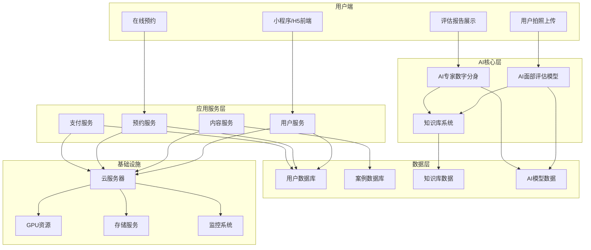
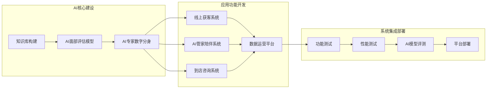
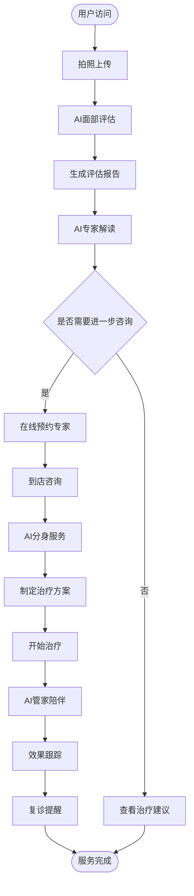
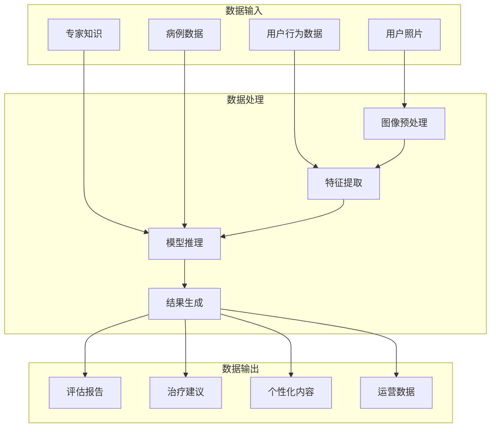
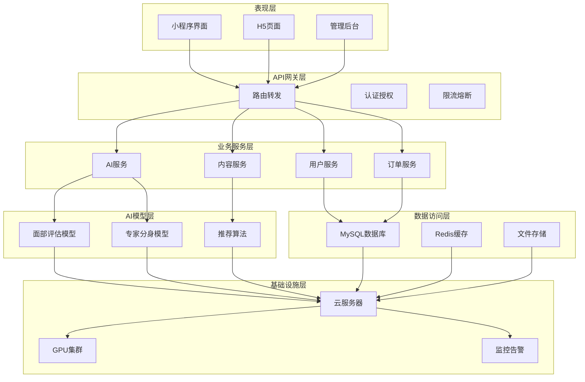

# AI颜值管家项目架构图

## 系统整体架构

```mermaid
graph TB
    subgraph "用户端"
        A[小程序/H5前端]
        B[用户拍照上传]
        C[评估报告展示]
        D[在线预约]
    end
    
    subgraph "AI核心层"
        E[AI面部评估模型]
        F[AI专家数字分身]
        G[知识库系统]
    end
    
    subgraph "应用服务层"
        H[用户服务]
        I[内容服务]
        J[预约服务]
        K[支付服务]
    end
    
    subgraph "数据层"
        L[用户数据库]
        M[案例数据库]
        N[知识库数据]
        O[AI模型数据]
    end
    
    subgraph "基础设施"
        P[云服务器]
        Q[GPU资源]
        R[存储服务]
        S[监控系统]
    end
    
    A --> H
    B --> E
    C --> F
    D --> J
    E --> G
    F --> G
    H --> L
    I --> M
    J --> L
    K --> L
    G --> N
    E --> O
    F --> O
    H --> P
    I --> P
    J --> P
    K --> P
    P --> Q
    P --> R
    P --> S
```

## 功能模块关系图

```mermaid
graph LR
    subgraph "AI核心建设"
        A1[知识库构建]
        A2[AI面部评估模型]
        A3[AI专家数字分身]
    end
    
    subgraph "应用功能开发"
        B1[线上获客系统]
        B2[AI管家陪伴系统]
        B3[到店咨询系统]
        B4[数据运营平台]
    end
    
    subgraph "系统集成部署"
        C1[功能测试]
        C2[性能测试]
        C3[AI模型评测]
        C4[平台部署]
    end
    
    A1 --> A2
    A2 --> A3
    A3 --> B1
    A3 --> B2
    A3 --> B3
    B1 --> B4
    B2 --> B4
    B3 --> B4
    B4 --> C1
    C1 --> C2
    C2 --> C3
    C3 --> C4
```

## 用户使用流程图

```mermaid
flowchart TD
    Start([用户访问]) --> A[拍照上传]
    A --> B[AI面部评估]
    B --> C[生成评估报告]
    C --> D[AI专家解读]
    D --> E{是否需要进一步咨询}
    E -->|是| F[在线预约专家]
    E -->|否| G[查看治疗建议]
    F --> H[到店咨询]
    H --> I[AI分身服务]
    I --> J[制定治疗方案]
    J --> K[开始治疗]
    K --> L[AI管家陪伴]
    L --> M[效果跟踪]
    M --> N[复诊提醒]
    N --> End([服务完成])
    G --> End
```

## 数据流转图

```mermaid
graph TD
    subgraph "数据输入"
        A[用户照片]
        B[用户行为数据]
        C[专家知识]
        D[病例数据]
    end
    
    subgraph "数据处理"
        E[图像预处理]
        F[特征提取]
        G[模型推理]
        H[结果生成]
    end
    
    subgraph "数据输出"
        I[评估报告]
        J[治疗建议]
        K[个性化内容]
        L[运营数据]
    end
    
    A --> E
    B --> F
    C --> G
    D --> G
    E --> F
    F --> G
    G --> H
    H --> I
    H --> J
    H --> K
    H --> L
```

## 技术架构分层图

```mermaid
graph TB
    subgraph "表现层"
        A[小程序界面]
        B[H5页面]
        C[管理后台]
    end
    
    subgraph "API网关层"
        D[路由转发]
        E[认证授权]
        F[限流熔断]
    end
    
    subgraph "业务服务层"
        G[用户服务]
        H[AI服务]
        I[内容服务]
        J[订单服务]
    end
    
    subgraph "AI模型层"
        K[面部评估模型]
        L[专家分身模型]
        M[推荐算法]
    end
    
    subgraph "数据访问层"
        N[MySQL数据库]
        O[Redis缓存]
        P[文件存储]
    end
    
    subgraph "基础设施层"
        Q[云服务器]
        R[GPU集群]
        S[监控告警]
    end
    
    A --> D
    B --> D
    C --> D
    D --> G
    D --> H
    D --> I
    D --> J
    G --> N
    H --> K
    H --> L
    I --> M
    J --> N
    K --> Q
    L --> Q
    M --> Q
    N --> Q
    O --> Q
    P --> Q
    Q --> R
    Q --> S
```

